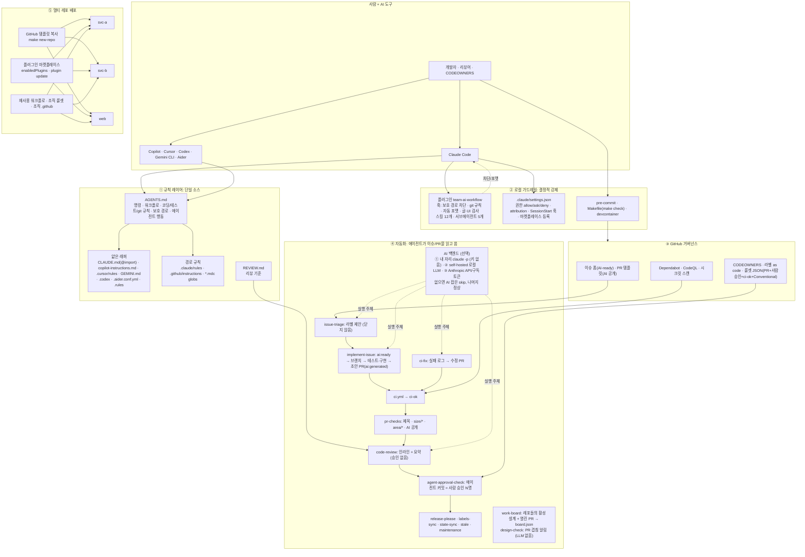
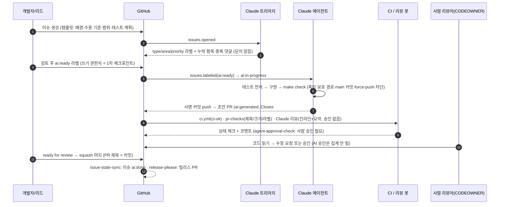

# AI Code Collaboration Best Practices: 팀 템플릿 레포

AI 코딩 에이전트(Claude Code · Copilot · Cursor · Codex · Gemini)를 쓰는 팀이 여러 레포에서 같은 규칙으로 일하게
해 주는 템플릿이에요. `git clone`(또는 "Use this template") 뒤 `make setup`을 한 번 돌리면 이렇게 돼요.

- 사람과 모든 에이전트가 `AGENTS.md` 하나를 규칙으로 읽어요. 도구별 파일은 그 파일을 가리키기만 해요.
- Claude Code 플러그인 `team-ai-workflow`가 설치돼요. 훅이 `.env*`·락파일·CODEOWNERS 같은 보호 경로 수정, `main`
  커밋, 공유 브랜치 force-push를 막고, 파일을 고칠 때마다 자동 포맷과 글·UI 기준 검사를 돌려요.
- pre-commit 훅(gitleaks·actionlint·shellcheck·yamllint·markdownlint·글·UI 기준·Conventional Commit)과 커밋
  템플릿이 깔려요.
- `make check` 하나가 CI와 같은 린트 → 글·UI 기준 → 타입체크 → 테스트를 돌려요. 스택(node/python/go/rust)은 자동으로
  감지해요.
- GitHub 워크플로 22개가 들어 있어요. 관리자가 `make github-setup`을 돌리면 squash-only, 라벨, 룰셋(PR 필수, 사람
  승인, `ci-ok`)도 적용돼요.

API 키는 필요 없어요. AI 작업은 각자 자리에서 본인 `claude` 구독 로그인으로 돌려요(`make ai-*`). 서버가 있으면 로컬
LLM(llama.cpp/Ollama)을 붙일 수 있고, 둘 다 없어도 AI 작업을 뺀 나머지는 모두 동작해요.

> 2026-10 기준 1차 문서(Anthropic · GitHub · OpenAI · Google · DORA · Thoughtworks 등)를 직접 확인해서 만들었어요.
> Gemini 조사 내용과 교차검증한 결과는 [docs/10-research-crosscheck.md](docs/10-research-crosscheck.md)에 있어요.

## 무엇이 들어 있나

| 영역 | 내용 |
| --- | --- |
| 규칙(컨텍스트) 단일화 | `AGENTS.md` 하나가 사람과 모든 에이전트의 규칙. `CLAUDE.md` · Copilot · Cursor · Gemini · Codex · Aider · Zed용 파일은 얇은 포인터 |
| Claude Code 팀 설정 | `.claude/settings.json`(권한 allow/ask/deny, 공동저자 표기, 세션 시작 훅, 플러그인 자동 등록), 경로별 규칙 |
| 플러그인 + 마켓플레이스 | `plugins/team-ai-workflow`. 훅: 보호 경로 차단 · git 규칙 · 자동 포맷 · 글·UI 기준 검사. 스킬 12개: `/design` `/check-overlap` `/implement-issue` `/create-pr` `/review-pr` `/fix-ci` `/split-pr` `/triage-issue` `/write-adr` `/onboard` `/polish-writing` `/polish-ui`. 서브에이전트: `code-reviewer` `security-reviewer` `test-writer` `issue-triager` `docs-writer`. 이 레포 자체가 마켓플레이스(`.claude-plugin/marketplace.json`) |
| GitHub 템플릿·거버넌스 | 에이전트용 이슈 폼 3종, PR 템플릿(AI 사용 공개 필수), CODEOWNERS, 라벨-as-code, Dependabot, 룰셋 JSON(브랜치 보호), squash-only 설정 스크립트 |
| 설계 먼저 + 팀 작업 보드 | 일의 크기별 T0/T1/T2. 큰 일은 1쪽 설계 + 구조도(`docs/designs/`, `/design`)를 먼저 머지. 여러 레포의 활성 설계와 열린 PR 파일을 모은 `board.json`을 세션 시작 때 한 줄씩 보여 주고, PR마다 겹침을 댓글로 알림(LLM 토큰 0). [docs/14](docs/14-design-first-and-overlap.md) |
| 가벼운 하네스 | 최신 모델 기준으로 규칙·스킬·훅을 덜어냄(AGENTS.md 약 60줄, 워크플로 스킬 10개 합계 약 100줄). 결정적 안전장치만 남김. 권한을 auto + 좁은 deny로 바꾸는 일은 사람이 `scripts/apply-lean-permissions.sh`로 적용. [docs/15](docs/15-lean-harness.md) |
| 팀 규모 운영 | 1인당 리뷰 대기 PR 상한·Reviewer guide, 계약(API/스키마) 먼저 + 깨지는 변경 자동 탐지(`contract-check`), 반복되는 리뷰 지적 → 규칙 제안, 스킬 평가(`make ai-eval`), 프로토타입/운영 레포 프로필. [docs/16](docs/16-team-scale-ai.md) |
| 글과 화면 기준 | 과장 수식어, 번역투, 말투 섞임, AI 기본 그라데이션 같은 AI 티를 규칙으로 잡음. Claude가 `.md`·`.html`·`.tsx` 등을 고칠 때마다 PostToolUse 훅이 `style_check.py`를 돌려 결과를 돌려주고(수정은 막지 않음), `make style` · pre-commit · CI가 같은 규칙을 적용(`error`는 CI 실패). 규칙으로 못 잡는 판단은 `polish-writing` · `polish-ui` 스킬. [docs/17](docs/17-writing-and-design-standards.md) |
| 자동화 22개 워크플로 | CI(스택 자동 감지, 글·UI 기준 포함) · PR 위생(제목/크기/라벨/AI 공개) · `@claude` 응답 · AI 코드 리뷰(참고용) · 이슈 트리아지 · `ai:ready` 라벨 → 에이전트 구현 → 초안 PR · CI 실패 자동 수정 PR · 에이전트 커밋 사람 승인 게이트 · 라벨 상태 동기화 · 주간 유지보수 리포트 · release-please · CodeQL · Dependabot 자동 머지 · stale · Copilot 환경 · 레포 부트스트랩 · 설정 검증 · 설계 겹침 확인 · 작업 보드/Pages · 계약 변경 검사 |
| 키 없는 AI 실행 경로 | `make ai-triage/ai-review/ai-implement/ai-fix-ci/ai-queue`: 개인 자리에서 `claude -p`(헤드리스)로 이슈 트리아지·PR 리뷰·구현·CI 수정·주간 리포트. 서버는 `infra/local-llm/`(llama.cpp/Ollama) + self-hosted 러너(`ai-local-runner.yml`). GitHub 호스티드 러너에서 Anthropic을 쓰는 것은 선택(`AI_BACKEND=anthropic`) |
| 로컬 재현 환경 | `Makefile`(스택 무관 `make check`), `scripts/bootstrap.sh`, pre-commit(gitleaks·actionlint·shellcheck·yamllint·markdownlint·글·UI 기준·conventional commit), devcontainer, EditorConfig, VS Code 권장 확장·MCP |
| 문서(한국어) | 플레이북, 브랜치/PR, 컨텍스트 파일, Claude 설정, 자동화, 리뷰 정책, 멀티 레포, 보안, 지표, 교차검증, 도구 매트릭스, 체크리스트, AI 백엔드, 설계 먼저·겹침, 가벼운 하네스, 팀 규모 운영, 글·화면 기준, ADR 7건 |

## 빠른 시작

```bash
# A. 새 제품 레포를 이 템플릿으로 만들기 (허브 클론 안에서)
make new-repo REPO=my-org/svc-payments VISIBILITY=private

# B. GitHub UI "Use this template"로 만든 뒤 / 또는 기존 레포에 파일을 복사한 뒤
git clone <repo> && cd <repo>
make setup            # 도구 확인 → 의존성 → pre-commit → Claude 플러그인 → 설정 검증
make github-setup     # (관리자, gh auth login) squash-only·자동머지·시크릿스캔·라벨·룰셋
# (선택) 서버에서도 AI를 돌리려면: gh variable set AI_BACKEND -b local|anthropic  → docs/13-ai-backends.md

# C. 팀원 (매일)
make check            # 린트 + 글·UI 기준 + 타입체크 + 테스트 = CI와 동일
claude                # /onboard, /implement-issue 123, /create-pr, /review-pr, /fix-ci

# D. AI 작업을 내 자리에서, API 키 없이 (본인 claude 로그인 사용)
make ai-triage ISSUE=12 POST=1     # 라벨 제안·적용 + 댓글 (닫지 않음)
make ai-review PR=34 POST=1        # 리뷰 코멘트 (승인 안 함)
make ai-implement ISSUE=12 POST=1  # 격리 worktree에서 구현 → 초안 PR
make ai-queue POST=1               # ai:ready 이슈를 순서대로 처리
```

## 전체 구조도

> 처음 보는 분은 해설 페이지부터 보세요. 6개 층 상세, 이슈→머지 단계별 예시, 라벨 상태, 막히는 것들, 역할별 시작법,
> 파일 지도가 있어요. 원본은 [docs/site/](docs/site/)이고, GitHub Pages(Settings → Pages → Source: GitHub Actions)를
> 켜면 `work-board.yml`이 페이지와 팀 작업 보드(`board.json`)를 함께 배포해요.


> 이미지 원본: [docs/images/architecture.html](docs/images/architecture.html) · 다시 그리기: `node scripts/render-diagram.mjs` · 아래는 같은 내용의 Mermaid 버전이에요.



<details>
<summary>텍스트 버전(Mermaid가 렌더되지 않을 때)</summary>

```text
사람 + AI 도구 (Claude Code / Copilot / Cursor / Codex / Gemini / Aider)
        │ 모두 같은 규칙을 읽는다
        ▼
① 규칙 레이어   AGENTS.md (단일 소스) ← CLAUDE.md(@import) · copilot-instructions · .cursor/rules · GEMINI.md · .codex · .aider · .rules
                경로 규칙(.claude/rules, .github/instructions, *.mdc) · REVIEW.md
        │ 지시는 컨텍스트일 뿐 → 강제는 아래 두 층에서
        ▼
② 로컬 가드레일 플러그인 훅(보호 경로·git 규칙·포맷·글/UI 검사) · settings.json 권한 · pre-commit · make check(글·UI 기준 포함)
        ▼
③ GitHub 거버넌스 이슈 폼 · PR 템플릿(AI 공개) · CODEOWNERS · 라벨 · 룰셋(PR + 사람 승인 + ci-ok) · Dependabot · CodeQL
        ▼
④ 자동화        (큰 일은 설계 PR 먼저) 이슈 → 트리아지 → ai:ready → 에이전트 구현 → 초안 PR → CI + AI 리뷰(참고) → 사람 승인(+에이전트 게이트) → squash 머지 → 릴리스
                팀 작업 보드: work-board가 모든 레포의 설계·열린 PR을 모으고 design-check가 겹침을 알림
                AI 실행 주체(선택): ① 내 자리 claude -p(키 없음) · ② self-hosted 로컬 LLM · ③ Anthropic API/구독 토큰 · 없으면 AI 잡 skip
        ▼
⑤ 배포          템플릿 복사(make new-repo) + 플러그인 마켓플레이스(plugin update) + 재사용 워크플로/조직 룰셋 → svc-a, svc-b, web …
```

</details>

## 이슈에서 머지까지 (에이전트 포함 흐름)



CI가 실패하면 `claude-ci-fix.yml`이 로그를 읽고 PR 브랜치로 향하는 수정 PR을 열거나 진단 댓글을 남겨요. 어느 단계에서든
`@claude`로 질문하거나 수정을 요청할 수 있어요.

## 레포 구조

```text
.
├── AGENTS.md                      # ★ 단일 소스: 명령·워크플로·규칙·보호 경로·에이전트 행동 (짧게: 약 60줄, 150줄 넘으면 경고)
├── CLAUDE.md                      # @AGENTS.md + Claude Code 전용 메모
├── GEMINI.md · REVIEW.md · .rules # Gemini 메모 · 리뷰 기준 · Zed 포인터
├── .claude/
│   ├── settings.json              # 팀 정책: 권한, attribution, SessionStart 훅, 마켓플레이스·플러그인
│   ├── hooks/session-start.sh     # 클론 직후/클라우드 세션에서 의존성·pre-commit·컨텍스트 준비
│   ├── rules/                     # paths: 경로별 규칙 (워크플로·테스트·AI 설정·글/UI)
│   └── skills/                    # 레포 전용 스킬: /new-repo, /validate-ai-config
├── .claude-plugin/marketplace.json# 이 레포 = 팀 마켓플레이스 "ai-collab"
├── plugins/team-ai-workflow/      # 공유 플러그인 (모든 레포에 배포)
│   ├── hooks/hooks.json + scripts/# protect-files · git-guard · format-after-edit · 글/UI 검사(style_check.py)
│   ├── skills/                    # design · check-overlap · implement-issue · create-pr · review-pr · fix-ci · split-pr · triage-issue · write-adr · onboard · polish-writing · polish-ui
│   ├── style/                     # rules.toml + style_check.py: 글·UI 규칙 (make style, 수정 직후 훅, CI)
│   └── agents/                    # code-reviewer · security-reviewer · test-writer · issue-triager · docs-writer
├── .github/
│   ├── ISSUE_TEMPLATE/            # Task(AI-ready) · Bug · Feature + config.yml
│   ├── pull_request_template.md   # 요약·변경·테스트 증거·AI 공개·체크리스트
│   ├── CODEOWNERS · labels.yml · labeler.yml · dependabot.yml
│   ├── copilot-instructions.md · instructions/*.instructions.md · agents/*.agent.md
│   ├── zizmor.yml                 # 워크플로 보안 감사 설정
│   └── workflows/                 # 22개 (아래 표)
├── .cursor/ (rules/*.mdc, BUGBOT.md) · .gemini/ (settings.json, config.yaml, styleguide.md) · .codex/config.toml
├── .aider.conf.yml · .coderabbit.yaml · .mcp.json · .vscode/ (settings, extensions, mcp.json)
├── scripts/
│   ├── ai/                        # 키 없는 헤드리스 AI 작업: triage · review · implement · fix-ci · respond · maintenance · queue · dispatch
│   ├── bootstrap.sh               # make setup
│   ├── stack.sh                   # 스택 자동 감지 (node/python/go/rust) → lint/typecheck/test/build
│   ├── check-ai-config.sh         # make ai-validate (플러그인·스키마·actionlint·shellcheck·yamllint·markdownlint)
│   ├── setup-github.sh            # make github-setup (설정·라벨·룰셋)
│   ├── new-repo.sh                # make new-repo
│   ├── pin-actions.sh             # 액션 SHA 핀
│   ├── designs/board.py           # 설계 색인 · 겹침 확인 · 팀 보드 집계 (make designs / make overlap)
│   ├── apply-lean-permissions.sh  # 사람이 실행: settings.json을 auto 모드 + 좁은 deny로 (docs/15)
│   ├── build-site.sh · render-diagram.mjs  # 해설 페이지 · 구조도 PNG 생성
│   └── rulesets/*.json            # 브랜치 보호 룰셋 (main · feature-branches · optional copilot review)
├── infra/local-llm/               # llama.cpp/Ollama 로컬 LLM 서버 + self-hosted 러너 가이드
├── docs/                          # 한국어 문서 01~17 + adr/ + designs/(설계 문서) + site/(해설 페이지)
├── Makefile · .pre-commit-config.yaml · .devcontainer/ · .editorconfig · .gitattributes · .gitmessage.txt
├── release-please-config.json · .release-please-manifest.json · version.txt
└── CONTRIBUTING.md · SECURITY.md · SUPPORT.md · CODE_OF_CONDUCT.md · LICENSE (MIT)
```

### 워크플로 요약

`claude*.yml`은 레포 변수 `AI_BACKEND=anthropic`, `ai-local-runner.yml`은 `AI_BACKEND=local`일 때만 실행돼요. 변수가
없으면 skipped로 끝나고 나머지는 그대로 동작해요.

| 워크플로 | 트리거 | 역할 |
| --- | --- | --- |
| `ci.yml` | PR · main · merge_group | `make setup-ci → lint → style → typecheck → test → build`, 필수 체크 `ci-ok` |
| `pr-checks.yml` | PR(메타데이터) | Conventional 제목 · `size/*` · `area/*` · AI 공개 체크 → `ai:assisted`/`ai:generated` |
| `ai-local-runner.yml` | 이슈·PR·댓글·CI 실패·주간 (`AI_BACKEND=local`) | self-hosted 러너 + 로컬 LLM에서 `scripts/ai/*` 실행 |
| `claude.yml` | `@claude` 멘션 (`AI_BACKEND=anthropic`) | 질문 응답 · 요청 변경 커밋 |
| `claude-code-review.yml` | PR | 인라인 코멘트 + 스티키 요약(승인 없음, 초안·봇·포크 제외) |
| `claude-issue-triage.yml` | 이슈 생성 | 라벨 제안·적용, 누락/중복 댓글(닫지 않음) |
| `claude-implement-issue.yml` | 라벨 `ai:ready` | 브랜치 → 테스트·구현 → 서명 커밋 → 초안 PR → `ai:review` / 실패 시 `ai:needs-human` |
| `claude-ci-fix.yml` | CI 실패(같은 레포 PR) | 로그 분석 → 수정 PR 또는 진단 댓글 |
| `agent-approval-check.yml` | PR · 리뷰 · 댓글 | 에이전트 커밋 포함 PR에 사람 승인 N명 상태 체크 |
| `issue-state-sync.yml` | PR 생성/머지 | 에이전트 PR 라벨, 머지 시 이슈 `ai:done` |
| `claude-maintenance.yml` | 매주 | 유지보수 리포트 이슈 |
| `validate-ai-config.yml` | 설정 변경 | `check-ai-config.sh` + zizmor |
| `contract-check.yml` | PR (계약 파일 변경 시) | OpenAPI/protobuf 깨지는 변경 탐지, `breaking-change` 라벨 없으면 실패, 소비자·설계 링크 안내 |
| `work-board.yml` · `design-check.yml` | 30분마다·main / PR | 팀 작업 보드(`board.json`)와 해설 페이지를 Pages에 배포 · PR의 설계/영역 겹침을 댓글로 알림(차단 안 함, LLM 없음) |
| `labels-sync.yml` · `release-please.yml` · `dependabot-auto-merge.yml` · `codeql.yml` · `stale.yml` · `copilot-setup-steps.yml` · `bootstrap-repo.yml` | 각각 | 라벨 동기화 · 릴리스 · 의존성 자동 머지 · 코드 스캐닝 · 정리 · Copilot 환경 · 레포 설정 적용 |

## 사람이 남아 있는 지점(의도적)

1. `ai:ready` 라벨은 쓰기 권한자만 붙여요(액션이 다시 확인해요).
2. 에이전트 PR은 초안으로 열리고, AI 리뷰는 승인으로 세지 않아요.
3. 에이전트 커밋이 있는 PR은 `agent-approval-check`가 사람 승인을 요구해요.
4. 보호 경로(`.env*`, 락파일, CODEOWNERS, 룰셋, `.claude/settings.json`)는 훅·CODEOWNERS·룰셋이 막아요.
5. 테스트를 끄거나 느슨하게 만드는 변경은 규칙·리뷰·프롬프트 세 곳에서 막아요.

## 도구별 지원 (요약)

| 도구 | 읽는 파일 | 비고 |
| --- | --- | --- |
| Claude Code | `CLAUDE.md`(→`AGENTS.md`), `.claude/*`, 플러그인 | 훅·스킬·서브에이전트·마켓플레이스 전부 지원 |
| GitHub Copilot(클라우드 에이전트·코드 리뷰·CLI·VS Code) | `AGENTS.md`, `copilot-instructions.md`, `instructions/`, `agents/`, `REVIEW.md`, `.claude/skills` | `copilot-setup-steps.yml`로 환경 준비 |
| Cursor | `AGENTS.md`, `.cursor/rules/*.mdc`, `BUGBOT.md` | |
| OpenAI Codex | `AGENTS.md`, `.codex/config.toml` | `@codex review` |
| Gemini CLI / Code Assist | `AGENTS.md`(설정), `GEMINI.md`, `.gemini/*` | |
| Aider · Zed · Jules · Amp · Warp · Devin · Junie · Kiro … | `AGENTS.md` (+ `.aider.conf.yml`, `.rules`) | [도구 매트릭스](docs/11-tool-support-matrix.md) |

## 문서

[docs/README.md](docs/README.md): 01 플레이북 · 02 브랜치/PR · 03 컨텍스트 파일 · 04 Claude Code 설정 · 05 GitHub 자동화 · 06 리뷰 정책 · 07 멀티 레포 · 08 보안/거버넌스 · 09 지표 · 10 교차검증 · 11 도구 매트릭스 · 12 셋업 체크리스트 · 13 AI 백엔드 · 14 설계 먼저·겹침 · 15 가벼운 하네스 · 16 팀 규모 운영 · 17 글·화면 기준 · ADR

## 커스터마이즈 포인트

`AGENTS.md`의 Project 섹션 · `.github/CODEOWNERS`의 `@OWNER` · `.github/ISSUE_TEMPLATE/config.yml`의 `OWNER/REPO` · `.claude/settings.json`의 마켓플레이스 경로 · `labels.yml`의 `area/*` · `ci.yml`/`codeql.yml` 언어 · `release-please-config.json`의 `release-type` · 워크플로의 `--max-turns`/모델 · AI 백엔드 변수(`AI_BACKEND`, `AI_BASE_URL`, `AI_MODEL`) · 레포별 글 규칙 추가·끄기(`.style/rules.toml`). 체크리스트: [docs/12-setup-checklist.md](docs/12-setup-checklist.md).

## 검증

`make ai-validate`가 플러그인·마켓플레이스 매니페스트(`claude plugin validate --strict`), `settings.json` JSON 스키마,
스킬/에이전트 프런트매터, 워크플로(actionlint), 셸 훅(shellcheck), YAML, Markdown, `AGENTS.md` 길이를 검사해요. 같은
검사가 pre-commit과 CI(`validate-ai-config.yml`)에서도 돌아요. 글·UI 기준은 `make style`이 따로 검사해요.

## 라이선스

MIT. 자유롭게 복제하고 고쳐 쓰세요. 문서에 인용한 외부 수치는 각 출처의 라이선스를 따라요.
