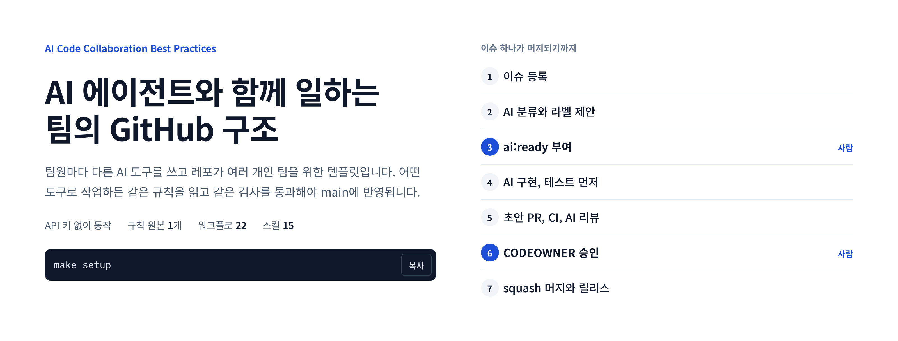
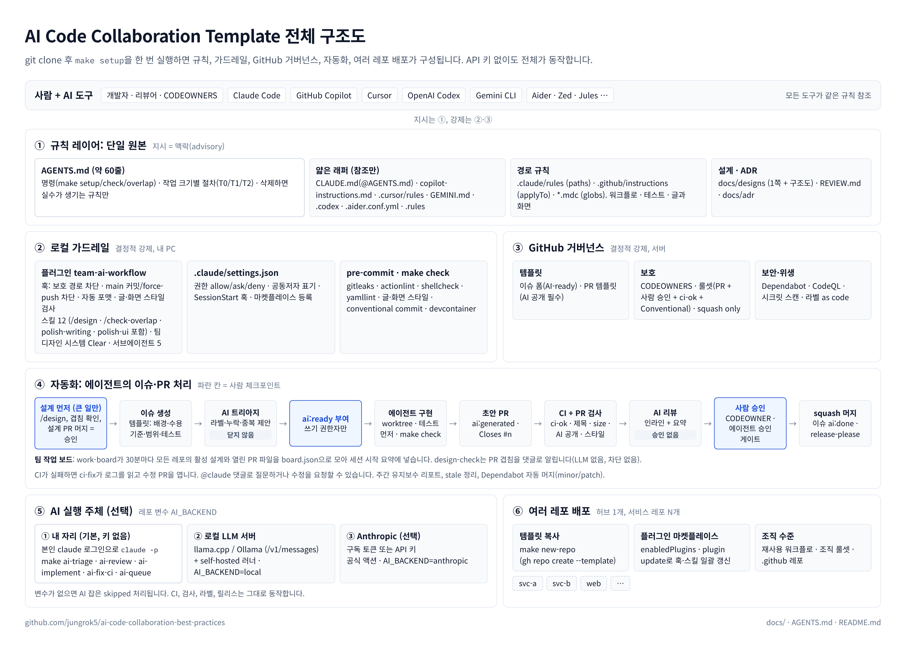
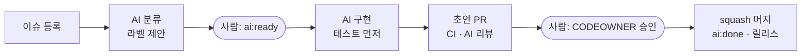

<picture>
  <source media="(prefers-color-scheme: dark)" srcset="docs/images/readme-hero-dark.png">
  
</picture>

어떤 AI 도구(Claude Code, Copilot, Cursor, Codex, Gemini)로 작업하든 같은 규칙을 읽고 같은 검사를 통과해야 main에
반영됩니다. API 키는 필요하지 않습니다. AI 작업은 각자 자리에서 본인의 `claude` 로그인으로 실행합니다. 서버 자동화는
필요할 때만 켭니다.

**해설 페이지:** https://jungrok5.github.io/ai-code-collaboration-best-practices/

처음 보는 경우 해설 페이지부터 읽으십시오. 이슈 하나가 머지되기까지의 예시, 강제 장치와 막혔을 때의 대안, 워크플로 전체
표, 역할별 시작 방법을 담고 있습니다. 이 README는 레포를 쓰는 데 필요한 요약과 명령만 둡니다.

<picture>
  <source media="(prefers-color-scheme: dark)" srcset="docs/images/architecture-dark.png">
  
</picture>

## 구성

| 층 | 내용 |
| --- | --- |
| ① 규칙 | `AGENTS.md` 하나(약 60줄)가 사람과 모든 에이전트의 규칙. 도구별 파일(`CLAUDE.md`, `copilot-instructions.md`, `.cursor/rules/` 등)은 이 파일을 가리키기만 함 |
| ② 로컬 가드레일 | Claude Code 플러그인 `team-ai-workflow`: 보호 경로 수정·main 커밋·강제 푸시 차단 훅, 수정 직후 포맷, 스킬 10개, 서브에이전트 5개. 글·화면 스킬 2개와 수정 직후 검사는 의존 플러그인 `ai-design`이 함께 설치됨. pre-commit과 `make check`가 같은 검사를 사람의 커밋에도 적용 |
| ③ GitHub 거버넌스 | 이슈 양식 3종, PR 템플릿(AI 사용 공개 필수), CODEOWNERS, 라벨, 룰셋(PR·사람 승인·`ci-ok`·squash만), CodeQL·비밀 스캔·Dependabot |
| ④ 자동화 | 워크플로 22개. 분류, `ai:ready` 이슈 구현, 초안 PR, AI 리뷰(참고용), CI 실패 수정, 설계 겹침 알림, 계약 변경 검사, 릴리스 |
| ⑤ AI 실행 주체 | 내 자리(`make ai-*`, 키 없음)가 기본. 서버 자동화는 사내 로컬 LLM 또는 Anthropic 중 선택(`AI_BACKEND`) |
| ⑥ 여러 레포 배포 | 템플릿 복사(`make new-repo`)로 시작하고 플러그인 마켓플레이스(`claude plugin update`)로 훅·스킬을 계속 갱신 |

팀 단위로 일할 때 필요한 운영 장치도 함께 들어 있습니다.

- **설계 먼저와 겹침 확인:** 큰 작업은 1쪽 설계를 먼저 머지합니다. 여러 레포의 활성 설계와 열린 PR을 모은 팀 작업 보드로 같은 영역의 중복 작업을 미리 찾습니다([docs/14](docs/14-design-first-and-overlap.md)).
- **가벼운 하네스:** 최신 모델 기준으로 규칙과 확인 절차를 줄이고 결정적 안전장치만 남겼습니다([docs/15](docs/15-lean-harness.md)).
- **팀 규모 운영:** 리뷰 대기 상한, 계약 우선, 반복되는 리뷰 지적의 규칙화, 스킬 평가, 프로토타입·운영 프로필을 둡니다([docs/16](docs/16-team-scale-ai.md)).
- **글과 화면 기준:** 합니다체 문서 기준, 내용 형식 규칙, 디자인 시스템 "Clear"를 정했습니다. 수정 직후 훅, pre-commit, CI가 같은 규칙으로 검사합니다. 스킬과 규칙의 원본은 다른 프로젝트에서도 쓸 수 있도록 [jungrok5/ai-design](https://github.com/jungrok5/ai-design)에 두고, 이 레포는 고정한 커밋을 씁니다([docs/17](docs/17-writing-and-design-standards.md)).
- **스킬 추가:** 개인, 커뮤니티, 팀 세 등급으로 추가합니다. 선택 설치용 `team-ai-community` 플러그인도 들어 있습니다([docs/18](docs/18-adding-skills.md)).

## 빠른 시작

새 서비스 레포를 만들 때는 허브(이 레포) 클론 안에서 실행합니다. GitHub의 "Use this template"으로 만들어도 됩니다.

```bash
make new-repo REPO=my-org/svc-payments VISIBILITY=private
```

레포 관리자는 처음 한 번 GitHub 설정을 적용합니다. 서버에서도 AI를 실행하려면 `AI_BACKEND` 변수를 설정합니다([docs/13](docs/13-ai-backends.md)).

```bash
make github-setup     # squash 전용, 자동 머지, 비밀 스캔, 라벨, 룰셋 (gh auth login 필요)
make doctor           # 남은 설정 항목 확인
```

팀원은 클론 후 한 번 준비합니다. 그리고 매일 커밋 전에 CI와 같은 검사를 실행합니다.

```bash
make setup            # 도구 확인, 의존성, pre-commit, Claude 플러그인, 설정 검증
make check            # 린트, 글·화면 기준, 타입체크, 테스트 (CI와 동일)
```

AI 작업은 내 자리에서 API 키 없이 실행합니다. `POST=1`을 붙일 때만 결과를 GitHub에 기록합니다.

```bash
make ai-triage ISSUE=12 POST=1     # 라벨 적용과 댓글 (이슈를 닫지 않음)
make ai-review PR=34 POST=1        # 리뷰 댓글 (승인하지 않음)
make ai-implement ISSUE=12 POST=1  # 별도 worktree에서 구현 후 초안 PR
make ai-queue POST=1               # ai:ready 이슈를 차례로 처리
make overlap AREAS="src/auth/**"   # 같은 영역을 작업 중인 사람 확인
```

## 작업 흐름

사람이 판단하는 지점은 두 곳입니다. 이 작업을 AI에 맡길지(`ai:ready`), 그리고 결과 코드를 받아들일지(CODEOWNER 승인)입니다.



- AI 리뷰는 승인으로 집계하지 않습니다. 에이전트 커밋이 있는 PR은 `agent-approval-check`가 사람 승인을 따로 요구합니다.
- 비밀 파일, 락파일, CODEOWNERS, 룰셋, `.claude/settings.json`은 사람만 수정합니다. 훅, CODEOWNERS, 룰셋이 막습니다.
- AI 관련 워크플로는 `AI_BACKEND`가 설정된 경우에만 실행됩니다. 설정이 없으면 skipped로 끝납니다. 나머지 워크플로는 그대로 동작합니다.

단계별 예시와 라벨 상태, 워크플로별 역할은 [해설 페이지](https://jungrok5.github.io/ai-code-collaboration-best-practices/#flow)에 있습니다.

## 도구별 지원

| 도구 | 읽는 파일 | 비고 |
| --- | --- | --- |
| Claude Code | `CLAUDE.md`(→`AGENTS.md`), `.claude/*`, 플러그인 | 훅, 스킬, 서브에이전트, 마켓플레이스 모두 지원 |
| GitHub Copilot | `AGENTS.md`, `copilot-instructions.md`, `instructions/`, `agents/`, `REVIEW.md` | `copilot-setup-steps.yml`로 클라우드 에이전트 환경 준비 |
| Cursor | `AGENTS.md`, `.cursor/rules/*.mdc`, `BUGBOT.md` | |
| OpenAI Codex | `AGENTS.md`, `.codex/config.toml` | `@codex review` |
| Gemini CLI · Code Assist | `AGENTS.md`, `GEMINI.md`, `.gemini/*` | |
| Aider · Zed · Jules 등 | `AGENTS.md`, `.aider.conf.yml`, `.rules` | [도구 매트릭스](docs/11-tool-support-matrix.md) |

Claude 훅은 Claude Code에서만 동작합니다. 다른 도구로 만든 변경은 pre-commit과 GitHub 룰셋이 같은 규칙으로 검사합니다.

## 레포 구조

```text
.
├── AGENTS.md                       # 팀 규칙의 단일 원본
├── CLAUDE.md · GEMINI.md · .rules  # 도구별 연결 파일
├── REVIEW.md                       # 리뷰 기준
├── .claude/
│   ├── settings.json               # 팀 정책: 권한, 공동저자 표기, 세션 훅, 플러그인 등록 (사람만 수정)
│   ├── hooks/session-start.sh      # 의존성·pre-commit 준비, 팀 작업 보드 요약
│   ├── rules/                      # 경로별 규칙 (워크플로, 테스트, AI 설정, 글과 화면)
│   └── skills/                     # 레포 전용 스킬: /new-repo, /new-skill, /validate-ai-config
├── .claude-plugin/marketplace.json # 이 레포 = 팀 마켓플레이스 "ai-collab" (ai-design은 고정 커밋으로 등록)
├── plugins/
│   ├── team-ai-workflow/           # 팀 플러그인: hooks/, skills/(10), agents/(5), evals/. 의존 플러그인 ai-design
│   └── team-ai-community/          # 선택 설치 스킬
├── .github/
│   ├── ISSUE_TEMPLATE/ · pull_request_template.md
│   ├── CODEOWNERS · labels.yml · labeler.yml · dependabot.yml · zizmor.yml
│   ├── copilot-instructions.md · instructions/ · agents/
│   └── workflows/                  # 22개
├── .cursor/ · .gemini/ · .codex/ · .aider.conf.yml · .coderabbit.yaml · .mcp.json · .vscode/
├── scripts/
│   ├── ai/                         # 키 없는 AI 작업 (triage, review, implement, fix-ci, respond, maintenance, queue)
│   ├── bootstrap.sh · stack.sh     # make setup, 스택 자동 감지 (node, python, go, rust)
│   ├── doctor.sh                   # make doctor: 설정 상태와 남은 항목
│   ├── ai-design.sh                # 고정 커밋의 ai-design을 .cache/에 받아 스타일 검사·디자인 파일 제공
│   ├── check-ai-config.sh          # make ai-validate
│   ├── setup-github.sh · rulesets/ # make github-setup, 브랜치 보호 룰셋
│   ├── new-repo.sh · new-skill.sh  # 새 레포, 새 스킬
│   ├── designs/board.py            # 설계 색인, 겹침 확인, 팀 보드 집계
│   ├── apply-lean-permissions.sh   # 사람이 실행: 권한을 auto 모드와 좁은 deny로 (docs/15)
│   └── build-site.sh · render-diagram.mjs  # 해설 페이지, README 이미지(라이트·다크) 생성
├── infra/local-llm/                # llama.cpp · Ollama 로컬 LLM 서버와 self-hosted 러너 안내
├── docs/                           # 문서 01~18, adr/, designs/, site/(해설 페이지), images/
├── Makefile · .pre-commit-config.yaml · .devcontainer/ · .editorconfig
└── CONTRIBUTING.md · SECURITY.md · SUPPORT.md · CODE_OF_CONDUCT.md · LICENSE
```

## 레포에 맞게 바꿀 곳

| 파일 | 바꿀 내용 |
| --- | --- |
| `AGENTS.md` | Project 섹션(목적, 스택, 패키지 매니저) |
| `.github/CODEOWNERS` | `@OWNER`를 실제 담당자로 |
| `.github/ISSUE_TEMPLATE/config.yml` | `OWNER/REPO` |
| `.github/labels.yml` | `area/*` 라벨 |
| `.claude/settings.json` | 마켓플레이스 경로 |
| `ci.yml` · `codeql.yml` | 언어 |
| `release-please-config.json` | `release-type` |
| 레포 변수 | `AI_BACKEND`, `AI_BASE_URL`, `AI_MODEL` |
| `.style/rules.toml` | 레포별 글·화면 규칙 추가 또는 끄기 |

전체 체크리스트는 [docs/12-setup-checklist.md](docs/12-setup-checklist.md)에 있고, `make doctor`가 같은 항목을 점검합니다.

## 검증

`make ai-validate`는 플러그인·마켓플레이스 매니페스트, `settings.json` 스키마, 스킬·에이전트 프런트매터, 워크플로(actionlint),
셸 스크립트(shellcheck), YAML, Markdown, `AGENTS.md` 길이를 검사합니다. 글·화면 기준은 `make style`이 검사합니다. 두 검사
모두 pre-commit과 CI에서도 실행됩니다.

## 문서

[docs/README.md](docs/README.md): 01 플레이북 · 02 브랜치와 PR · 03 컨텍스트 파일 · 04 Claude Code 설정 · 05 GitHub 자동화 ·
06 리뷰 정책 · 07 여러 레포 · 08 보안과 거버넌스 · 09 지표 · 10 교차검증 · 11 도구 매트릭스 · 12 설정 체크리스트 ·
13 AI 백엔드 · 14 설계 먼저와 겹침 · 15 가벼운 하네스 · 16 팀 규모 운영 · 17 글과 화면 기준 · 18 스킬 추가 · ADR

2026년 10월 기준 1차 문서(Anthropic, GitHub, OpenAI, Google, DORA, Thoughtworks 등)를 직접 확인해 작성했습니다.
다른 조사 결과와의 교차검증은 [docs/10](docs/10-research-crosscheck.md)에 있습니다.

## 라이선스

MIT. 문서에 인용한 외부 수치는 각 출처의 라이선스를 따릅니다.
