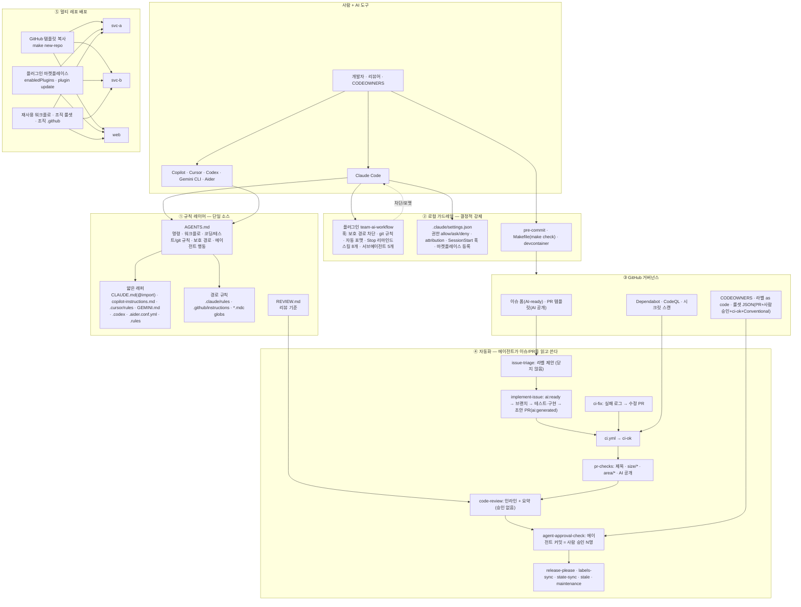
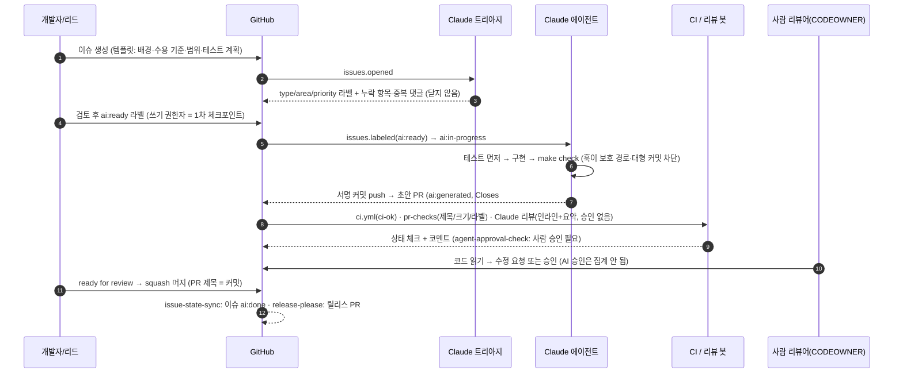

# AI Code Collaboration Best Practices — 팀 템플릿 레포

**AI 코딩 에이전트(Claude Code · Copilot · Cursor · Codex · Gemini)를 적극 쓰는 팀이, 여러 레포에서 일관되게 협업하기 위한 "복제하면 바로 되는" 템플릿**입니다.
`git clone` 또는 "Use this template" → `make setup` 한 번이면 규칙·가드레일·GitHub 자동화·리뷰 정책이 갖춰진 상태에서 시작합니다.

> 2026-10 기준 1차 문서(Anthropic · GitHub · OpenAI · Google · DORA · Thoughtworks 등)를 직접 검증해 만들었습니다.
> Gemini 조사 내용과의 교차검증 결과는 [docs/10-research-crosscheck.md](docs/10-research-crosscheck.md)에 있습니다.

## 무엇이 들어 있나

| 영역 | 내용 |
| --- | --- |
| **규칙(컨텍스트) 단일화** | `AGENTS.md` 하나가 사람과 모든 에이전트의 규칙. `CLAUDE.md` · Copilot · Cursor · Gemini · Codex · Aider · Zed용 파일은 얇은 포인터 |
| **Claude Code 팀 설정** | `.claude/settings.json`(권한 allow/ask/deny, 공동저자 표기, 세션 시작 훅, 플러그인 자동 등록), 경로별 규칙 |
| **플러그인 + 마켓플레이스** | `plugins/team-ai-workflow`: 보호 경로·git 규칙·자동 포맷 **훅**, `/implement-issue` `/create-pr` `/review-pr` `/fix-ci` `/split-pr` `/triage-issue` `/write-adr` `/onboard` **스킬**, `code-reviewer` `security-reviewer` `test-writer` `issue-triager` `docs-writer` **서브에이전트**. 이 레포 자체가 마켓플레이스(`.claude-plugin/marketplace.json`) |
| **GitHub 템플릿·거버넌스** | 에이전트 친화 이슈 폼 3종, PR 템플릿(AI 공개 필수), CODEOWNERS, 라벨-as-code, Dependabot, 룰셋 JSON(브랜치 보호), squash-only 설정 스크립트 |
| **자동화 18개 워크플로** | CI(스택 자동 감지) · PR 위생(제목/크기/라벨/AI 공개) · `@claude` 응답 · AI 코드 리뷰(참고용) · 이슈 트리아지 · **`ai:ready` 라벨 → 에이전트 구현 → 초안 PR** · CI 실패 자동 수정 PR · 에이전트 커밋 사람 승인 게이트 · 라벨 상태 동기화 · 주간 유지보수 리포트 · release-please · CodeQL · Dependabot 자동 머지 · stale · Copilot 환경 · 레포 부트스트랩 · 설정 검증 |
| **로컬 재현 환경** | `Makefile`(스택 무관 `make check`), `scripts/bootstrap.sh`, pre-commit(gitleaks·actionlint·shellcheck·yamllint·markdownlint·conventional commit), devcontainer, EditorConfig, VS Code 권장 확장·MCP |
| **문서(한국어)** | 플레이북, 브랜치/PR, 컨텍스트 파일, Claude 설정, 자동화, 리뷰 정책, 멀티 레포, 보안, 지표, 교차검증, 도구 매트릭스, 체크리스트, ADR 5건 |

## 빠른 시작

```bash
# A. 새 제품 레포를 이 템플릿으로 만들기 (허브 클론 안에서)
make new-repo REPO=my-org/svc-payments VISIBILITY=private

# B. GitHub UI "Use this template"로 만든 뒤 / 또는 기존 레포에 파일을 복사한 뒤
git clone <repo> && cd <repo>
make setup            # 도구 확인 → 의존성 → pre-commit → Claude 플러그인 → 설정 검증
make github-setup     # (관리자, gh auth login) squash-only·자동머지·시크릿스캔·라벨·룰셋
gh secret set ANTHROPIC_API_KEY   # + Claude GitHub App 설치: claude 안에서 /install-github-app

# C. 팀원 (매일)
make check            # 린트 + 타입체크 + 테스트 = CI와 동일
claude                # /onboard, /implement-issue 123, /create-pr, /review-pr, /fix-ci
```

## 전체 구조도



<details>
<summary>텍스트 버전(Mermaid가 렌더되지 않을 때)</summary>

```text
사람 + AI 도구 (Claude Code / Copilot / Cursor / Codex / Gemini / Aider)
        │ 모두 같은 규칙을 읽는다
        ▼
① 규칙 레이어   AGENTS.md (단일 소스) ← CLAUDE.md(@import) · copilot-instructions · .cursor/rules · GEMINI.md · .codex · .aider · .rules
                경로 규칙(.claude/rules, .github/instructions, *.mdc) · REVIEW.md
        │ 지시는 컨텍스트일 뿐 → 강제는 아래 두 층에서
        ▼
② 로컬 가드레일 플러그인 훅(보호 경로·git 규칙·포맷) · settings.json 권한 · pre-commit · make check
        ▼
③ GitHub 거버넌스 이슈 폼 · PR 템플릿(AI 공개) · CODEOWNERS · 라벨 · 룰셋(PR + 사람 승인 + ci-ok) · Dependabot · CodeQL
        ▼
④ 자동화        이슈 → 트리아지 → ai:ready → 에이전트 구현 → 초안 PR → CI + AI 리뷰(참고) → 사람 승인(+에이전트 게이트) → squash 머지 → 릴리스
        ▼
⑤ 배포          템플릿 복사(make new-repo) + 플러그인 마켓플레이스(plugin update) + 재사용 워크플로/조직 룰셋 → svc-a, svc-b, web …
```

</details>

## 이슈에서 머지까지 (에이전트 포함 흐름)



CI가 실패하면 `claude-ci-fix.yml`이 로그를 읽고 PR 브랜치를 향한 수정 PR을 열거나 진단 댓글을 남깁니다. 어떤 단계에서든 `@claude`로 질문·수정 요청을 할 수 있습니다.

## 레포 구조

```text
.
├── AGENTS.md                      # ★ 단일 소스: 명령·워크플로·규칙·보호 경로·에이전트 행동 (≤200줄)
├── CLAUDE.md                      # @AGENTS.md + Claude Code 전용 메모
├── GEMINI.md · REVIEW.md · .rules # Gemini 메모 · 리뷰 기준 · Zed 포인터
├── .claude/
│   ├── settings.json              # 팀 정책: 권한, attribution, SessionStart 훅, 마켓플레이스·플러그인
│   ├── hooks/session-start.sh     # 클론 직후/클라우드 세션에서 의존성·pre-commit·컨텍스트 준비
│   ├── rules/                     # paths: 경로별 규칙 (워크플로·테스트·AI 설정)
│   └── skills/                    # 레포 전용 스킬: /new-repo, /validate-ai-config
├── .claude-plugin/marketplace.json# 이 레포 = 팀 마켓플레이스 "ai-collab"
├── plugins/team-ai-workflow/      # 공유 플러그인 (모든 레포에 배포)
│   ├── hooks/hooks.json + scripts/# protect-files · git-guard · format-after-edit · stop-summary
│   ├── skills/                    # implement-issue · create-pr · review-pr · fix-ci · split-pr · triage-issue · write-adr · onboard
│   └── agents/                    # code-reviewer · security-reviewer · test-writer · issue-triager · docs-writer
├── .github/
│   ├── ISSUE_TEMPLATE/            # Task(AI-ready) · Bug · Feature + config.yml
│   ├── pull_request_template.md   # 요약·변경·테스트 증거·AI 공개·체크리스트
│   ├── CODEOWNERS · labels.yml · labeler.yml · dependabot.yml
│   ├── copilot-instructions.md · instructions/*.instructions.md · agents/*.agent.md
│   ├── zizmor.yml                 # 워크플로 보안 감사 설정
│   └── workflows/                 # 18개 (아래 표)
├── .cursor/ (rules/*.mdc, BUGBOT.md) · .gemini/ (settings.json, config.yaml, styleguide.md) · .codex/config.toml
├── .aider.conf.yml · .coderabbit.yaml · .mcp.json · .vscode/ (settings, extensions, mcp.json)
├── scripts/
│   ├── bootstrap.sh               # make setup
│   ├── stack.sh                   # 스택 자동 감지 (node/python/go/rust) → lint/typecheck/test/build
│   ├── check-ai-config.sh         # make ai-validate (플러그인·스키마·actionlint·shellcheck·yamllint·markdownlint)
│   ├── setup-github.sh            # make github-setup (설정·라벨·룰셋)
│   ├── new-repo.sh                # make new-repo
│   ├── pin-actions.sh             # 액션 SHA 핀
│   └── rulesets/*.json            # 브랜치 보호 룰셋 (main · feature-branches · optional copilot review)
├── docs/                          # 한국어 문서 01~12 + adr/
├── Makefile · .pre-commit-config.yaml · .devcontainer/ · .editorconfig · .gitattributes · .gitmessage.txt
├── release-please-config.json · .release-please-manifest.json · version.txt
└── CONTRIBUTING.md · SECURITY.md · SUPPORT.md · CODE_OF_CONDUCT.md · LICENSE (MIT)
```

### 워크플로 요약

| 워크플로 | 트리거 | 역할 |
| --- | --- | --- |
| `ci.yml` | PR · main · merge_group | `make setup-ci → lint → typecheck → test → build`, 필수 체크 **`ci-ok`** |
| `pr-checks.yml` | PR(메타데이터) | Conventional 제목 · `size/*` · `area/*` · **AI 공개 체크** → `ai:assisted`/`ai:generated` |
| `claude.yml` | `@claude` 멘션 | 질문 응답 · 요청 변경 커밋 |
| `claude-code-review.yml` | PR | 인라인 코멘트 + 스티키 요약(승인 없음, 초안·봇·포크 제외) |
| `claude-issue-triage.yml` | 이슈 생성 | 라벨 제안·적용, 누락/중복 댓글(닫지 않음) |
| `claude-implement-issue.yml` | 라벨 `ai:ready` | 브랜치 → 테스트·구현 → 서명 커밋 → **초안 PR** → `ai:review` / 실패 시 `ai:needs-human` |
| `claude-ci-fix.yml` | CI 실패(같은 레포 PR) | 로그 분석 → 수정 PR 또는 진단 댓글 |
| `agent-approval-check.yml` | PR · 리뷰 · 댓글 | 에이전트 커밋 포함 PR에 사람 승인 N명 상태 체크 |
| `issue-state-sync.yml` | PR 생성/머지 | 에이전트 PR 라벨, 머지 시 이슈 `ai:done` |
| `claude-maintenance.yml` | 매주 | 유지보수 리포트 이슈 |
| `validate-ai-config.yml` | 설정 변경 | `check-ai-config.sh` + zizmor |
| `labels-sync.yml` · `release-please.yml` · `dependabot-auto-merge.yml` · `codeql.yml` · `stale.yml` · `copilot-setup-steps.yml` · `bootstrap-repo.yml` | 각각 | 라벨 동기화 · 릴리스 · 의존성 자동 머지 · 코드 스캐닝 · 정리 · Copilot 환경 · 레포 설정 적용 |

## 사람이 남아 있는 지점(의도적)

1. `ai:ready` 라벨은 쓰기 권한자만 붙인다(액션이 재검증).
2. 에이전트 PR은 **초안**으로 열리고, AI 리뷰는 승인으로 **집계되지 않는다**.
3. 에이전트 커밋이 있는 PR은 `agent-approval-check`가 사람 승인을 요구한다.
4. 보호 경로(`.env*`, 락파일, CODEOWNERS, 룰셋, `.claude/settings.json`)는 훅·CODEOWNERS·룰셋이 막는다.
5. 테스트를 끄거나 느슨하게 만드는 변경은 규칙·리뷰·프롬프트 3중으로 금지된다.

## 도구별 지원 (요약)

| 도구 | 읽는 파일 | 비고 |
| --- | --- | --- |
| Claude Code | `CLAUDE.md`(→`AGENTS.md`), `.claude/*`, 플러그인 | 훅·스킬·서브에이전트·마켓플레이스 전부 지원 |
| GitHub Copilot(클라우드 에이전트·코드 리뷰·CLI·VS Code) | `AGENTS.md`, `copilot-instructions.md`, `instructions/`, `agents/`, `REVIEW.md`, `.claude/skills` | `copilot-setup-steps.yml`로 환경 준비 |
| Cursor | `AGENTS.md`, `.cursor/rules/*.mdc`, `BUGBOT.md` | |
| OpenAI Codex | `AGENTS.md`, `.codex/config.toml` | `@codex review` |
| Gemini CLI / Code Assist | `AGENTS.md`(설정), `GEMINI.md`, `.gemini/*` | |
| Aider · Zed · Jules · Amp · Warp · Devin · Junie · Kiro … | `AGENTS.md` (+ `.aider.conf.yml`, `.rules`) | [도구 매트릭스](docs/11-tool-support-matrix.md) |

## 문서

[docs/README.md](docs/README.md) — 01 플레이북 · 02 브랜치/PR · 03 컨텍스트 파일 · 04 Claude Code 설정 · 05 GitHub 자동화 · 06 리뷰 정책 · 07 멀티 레포 · 08 보안/거버넌스 · 09 지표 · 10 교차검증 · 11 도구 매트릭스 · 12 셋업 체크리스트 · ADR

## 커스터마이즈 포인트

`AGENTS.md` §1(프로젝트 스냅샷) · `.github/CODEOWNERS`의 `@OWNER` · `.github/ISSUE_TEMPLATE/config.yml`의 `OWNER/REPO` · `.claude/settings.json`의 마켓플레이스 경로 · `labels.yml`의 `area/*` · `ci.yml`/`codeql.yml` 언어 · `release-please-config.json`의 `release-type` · 워크플로의 `--max-turns`/모델. 체크리스트: [docs/12-setup-checklist.md](docs/12-setup-checklist.md).

## 검증

`make ai-validate`가 플러그인·마켓플레이스 매니페스트(`claude plugin validate --strict`), `settings.json` JSON 스키마, 스킬/에이전트 프런트매터, 워크플로(actionlint), 셸 훅(shellcheck), YAML, Markdown, `AGENTS.md` 길이를 검사합니다. 같은 검사가 pre-commit과 CI(`validate-ai-config.yml`)에서 돕니다.

## 라이선스

MIT — 자유롭게 복제·수정하세요. 문서의 외부 수치는 각 출처의 라이선스를 따릅니다.
