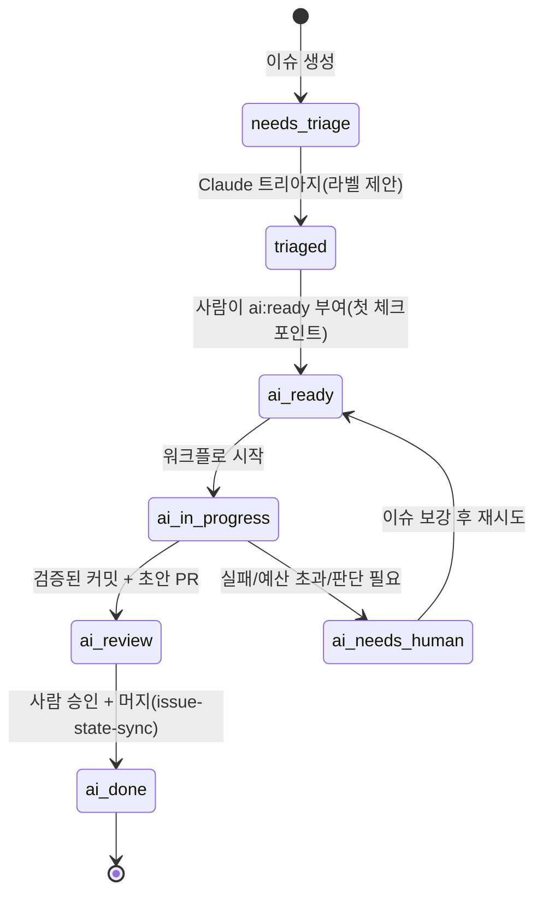

# 05. GitHub 자동화 — 에이전트가 이슈와 PR을 읽고 쓰는 방법

## 1. 워크플로 한눈에

| 워크플로 | 트리거 | 하는 일 | 쓰기 권한 | 비용 상한 |
| --- | --- | --- | --- | --- |
| `ci.yml` | PR, main push, merge_group | `make setup-ci → lint → typecheck → test → build`; 필수 체크 `ci-ok` | 없음 | — |
| `pr-checks.yml` | pull_request_target(메타데이터만) | 제목 Conventional 검사, `size/*`, `area/*` 라벨, **AI 공개 체크박스** 검증 → `ai:assisted`/`ai:generated` | PR 라벨 | — |
| `validate-ai-config.yml` | 설정 파일 변경 | `scripts/check-ai-config.sh`(플러그인·스키마·actionlint·shellcheck·yamllint·markdownlint) + zizmor | SARIF 업로드 | — |
| `ai-local-runner.yml` | 이슈·PR·댓글·CI 실패·주간(`AI_BACKEND=local`) | self-hosted 러너 + 로컬 LLM에서 `scripts/ai/dispatch.sh` 실행 | contents/PR/issues | 스크립트별 턴 상한 |
| `claude.yml` | `@claude` 멘션(이슈/PR 댓글/리뷰) | 질문 답변, 요청한 변경을 커밋·푸시, "Create PR" 링크 | contents/PR/issues | 30턴 |
| `claude-code-review.yml` | PR opened/synchronize/ready | 인라인 코멘트 + 스티키 요약(**승인 안 함**); 초안·봇·포크 PR 제외 | PR 코멘트 | 30턴, 새 push 시 취소 |
| `claude-issue-triage.yml` | 이슈 opened | type/area/priority/size 라벨 제안·적용, 누락 항목·중복 1회 댓글(닫지 않음) | issues | 12턴, Bash 금지 |
| `claude-implement-issue.yml` | 라벨 `ai:ready` | 브랜치 생성 → 테스트·구현 → `make check` 통과 커밋(서명) → **초안 PR** `ai:generated` → 이슈 `ai:review` | contents/PR/issues | 60턴, 45분 |
| `claude-ci-fix.yml` | CI 실패(workflow_run, 같은 레포 PR) | 실패 로그 수집 → 근본 원인 수정 → PR 브랜치를 향한 수정 PR 또는 진단 댓글 | contents/PR | 40턴 |
| `agent-approval-check.yml` | PR, 리뷰, 댓글 | 에이전트 커밋이 포함된 PR에 **사람 승인 N명** 상태 체크 `agent-approval-check` | statuses | — |
| `issue-state-sync.yml` | PR opened/closed | 에이전트 PR에 `ai:generated`; 머지 시 연결 이슈 `ai:done` | issues/PR | — |
| `claude-maintenance.yml` | 매주 월요일 | 유지보수 리포트 이슈 1개 생성 | issues | 20턴 |
| `labels-sync.yml` | labels.yml 변경 | 라벨 동기화(PR에서는 dry-run) | issues | — |
| `release-please.yml` | main push | 릴리스 PR/태그 | contents/PR | — |
| `dependabot-auto-merge.yml` | Dependabot PR | minor/patch 자동 승인·자동 머지 | contents/PR | — |
| `codeql.yml` | PR, main, 주간 | 코드 스캐닝(기본: Actions 워크플로; 언어 추가) | security-events | — |
| `stale.yml` | 매일 | 60일 무활동 → 7일 후 닫힘(`ai:in-progress`, p0, blocked 제외) | issues/PR | — |
| `copilot-setup-steps.yml` | 자기 파일 변경 | Copilot 클라우드 에이전트 환경 준비 | 없음 | — |
| `bootstrap-repo.yml` | 수동 | 레포 설정·라벨·룰셋 적용(`REPO_ADMIN_TOKEN`) | admin 토큰 | — |

`claude*.yml`은 `AI_BACKEND=anthropic`, `ai-local-runner.yml`은 `AI_BACKEND=local`일 때만 실행됩니다(변수가 비어 있으면 skipped). 모든 워크플로: 최상위 `permissions: contents: read`, 잡 단위로만 확대, `timeout-minutes`, PR 잡은 `concurrency`. 서드파티 액션은 SHA 핀(`scripts/pin-actions.sh`) + Dependabot 갱신.

## 2. 라벨 상태 머신



루프 방지: 워크플로가 바꾸는 라벨은 `GITHUB_TOKEN`으로 바꾸므로 다른 워크플로를 재트리거하지 않는다. Claude 액션은 봇 트리거를 거부한다(`allowed_bots` 비움). CI-fix는 자기 브랜치(`ai/ci-fix-*`)를 제외한다.

## 3. 사람 체크포인트(의도적으로 남긴 것)

1. `ai:ready` 라벨은 **쓰기 권한자**만 붙일 수 있고, 액션이 라벨 부여자의 권한을 다시 검사한다.
2. 에이전트 PR은 **초안**으로 열린다. 리뷰어가 ready로 바꾼다.
3. AI 리뷰는 승인으로 집계되지 않는다(Copilot 기본, Claude Code Review는 항상 neutral).
4. 에이전트 커밋이 포함된 PR은 `agent-approval-check`가 사람 승인 N명을 요구한다(Anthropic 내부와 같은 게이트).
5. `risk/low` + `ai:generated` + 승인 완료 → 자동 머지는 **옵션**(기본 꺼짐; 06 문서).

## 4. 백엔드 선택 (기본: 아무것도 안 해도 됨)

| `AI_BACKEND` 변수 | 동작 |
| --- | --- |
| (비움, 기본) | `claude*.yml`과 `ai-local-runner.yml`은 전부 **skipped**. CI·PR 검사·라벨·릴리스는 정상 |
| `anthropic` | `claude*.yml`이 공식 액션으로 실행. 시크릿 `CLAUDE_CODE_OAUTH_TOKEN`(구독, `claude setup-token`) 또는 `ANTHROPIC_API_KEY` 필요 |
| `local` | `ai-local-runner.yml`이 self-hosted 러너에서 `scripts/ai/dispatch.sh` 실행. 변수 `AI_BASE_URL`, `AI_MODEL`(로컬 LLM) |

개발자는 백엔드와 무관하게 자기 자리에서 `make ai-triage ISSUE=1` 같은 명령으로 같은 작업을 돌릴 수 있습니다(구독 로그인, 키 불필요). 자세한 선택 가이드: `docs/13-ai-backends.md`.

```bash
# ③ Anthropic 모드일 때만
gh variable set AI_BACKEND -b anthropic
gh secret set CLAUDE_CODE_OAUTH_TOKEN        # 또는 gh secret set ANTHROPIC_API_KEY
# Claude GitHub App 설치: claude 안에서 /install-github-app (또는 https://github.com/apps/claude)
# ② 로컬 모드일 때만
gh variable set AI_BACKEND -b local; gh variable set AI_BASE_URL -b http://127.0.0.1:8080; gh variable set AI_MODEL -b local-coder
# 공통(관리자 1회)
make github-setup                            # 설정·라벨·룰셋
gh secret set RELEASE_PLEASE_TOKEN           # 선택: 릴리스 태그로 배포 워크플로를 트리거할 때
```

- 구독 토큰은 개인에게 묶이므로 조직 레포는 API 키 또는 **Workload Identity Federation**(정적 키 없음) 권장. Bedrock/Vertex/Foundry는 `use_bedrock|use_vertex|use_foundry` + OIDC + 커스텀 GitHub App.
- 공개 레포에서 쓰기 권한 없는 사용자의 이슈를 트리아지하려면 `allowed_non_write_users: "*"` + `github_token: ${{ secrets.GITHUB_TOKEN }}`(워크플로 주석 참고). PAT는 절대 넣지 않는다.

## 5. 액션 동작 요점 (anthropics/claude-code-action@v1)

- `prompt`가 있으면 자동화 모드(멘션 불필요, 추적 댓글 없음), 없으면 태그 모드(`@claude`, `label_trigger`, `assignee_trigger`; 추적 댓글·안전한 push 래퍼). `track_progress: true`는 prompt를 쓰면서 태그 모드.
- 기본 도구는 파일 읽기/편집, 댓글, 기본 GitHub 조작뿐. Bash는 `--allowedTools "Bash(make test)"`처럼 **명시**해야 한다.
- 내장 MCP: `mcp__github_comment__*`, `mcp__github_inline_comment__create_inline_comment`(PR 승인 불가), `mcp__github_ci__*`(actions: read), `mcp__github__*`(공식 GitHub MCP 서버 v0.17.1 — `get_issue`, `update_issue`, `add_issue_comment`, `create_pull_request` 등 **구 이름**).
- PR 이벤트에서는 `.claude/`, `CLAUDE.md`, `.mcp.json`, 훅을 **베이스 브랜치에서 복원**한다(PR이 Claude 설정을 바꿀 수 없음). 훅은 `npm run` 대신 바이너리를 직접 부른다.
- Claude는 PR을 열지 않고 "Create PR" 링크를 남기는 것이 기본. 이 레포는 액션 출력 `branch_name`/`github_token`으로 **결정적 단계**가 초안 PR을 연다.
- `use_commit_signing: true` → API 커밋(Verified), 서명 커밋 규칙과 호환.
- 비용: `--max-turns`, `timeout-minutes`, `concurrency`, `--model`(예: `claude-sonnet-5-5`), `--max-budget-usd`(CLI).

## 6. 다른 에이전트/리뷰 봇과 함께 쓰기

| 도구 | 시작 방법 | 설정 파일 | 비고 |
| --- | --- | --- | --- |
| **Copilot 클라우드 에이전트** | 이슈 담당자(Assignees)에 Copilot 지정, `gh agent-task create "…"`, MCP `assign_copilot_to_issue` | `AGENTS.md`, `copilot-setup-steps.yml`, 레포 설정의 MCP/방화벽 | 초안 PR, 요청자 승인 미집계, Actions는 "Approve and run workflows" 필요 |
| **Copilot code review** | 룰셋 "Automatically request Copilot code review"(`scripts/rulesets/optional-copilot-review.json`) | `copilot-instructions.md`, `*.instructions.md`, `REVIEW.md` | 기본은 승인 미집계; Lite/Balanced |
| **OpenAI Codex** | PR 댓글 `@codex review`, 설정에서 Automatic review | `AGENTS.md` `## Code Review Rules` | P0/P1만 플래그 |
| **Google Jules** | 이슈에 라벨 `jules` | `AGENTS.md` | 완료 시 PR 링크 댓글 |
| **Gemini Code Assist** | 자동 리뷰, `/gemini review` | `.gemini/config.yaml`, `styleguide.md` | 소비자용 앱은 2026-07 종료, 엔터프라이즈만 |
| **CodeRabbit** | 자동 리뷰, `@coderabbitai review` | `.coderabbit.yaml` | 공개 레포 무료 |
| **Cursor Bugbot** | 자동, `bugbot run` | `.cursor/BUGBOT.md`, `.cursor/config/bugbot.yaml` | 사용량 과금 |
| **GitHub Agentic Workflows(gh-aw)** | `.github/workflows/*.md` → `gh aw compile` | 프런트매터 + 마크다운, `safe-outputs` | 읽기 전용 에이전트 + 검증된 쓰기(프리뷰) |

여러 리뷰 봇을 동시에 켜면 소음이 커진다. 한 개(기본: Claude)로 시작해 2–4주 보정 후 늘린다(06 문서).

## 7. 끄거나 바꾸기

- 쓰지 않는 워크플로는 파일을 지우거나 `on:`을 `workflow_dispatch`만 남긴다.
- 모델/턴/도구는 각 워크플로의 `claude_args`에서. 프롬프트는 파일 안에 있어 PR로 리뷰된다.
- 조직 전체에 같은 워크플로를 강제하려면 `workflow_call`로 재사용 워크플로를 만들고 조직 룰셋 "Require workflows to pass"로 요구한다(07 문서).

## 출처

- claude-code-action: https://github.com/anthropics/claude-code-action (README, docs/, examples/) · Claude Code GitHub Actions: https://code.claude.com/docs/en/github-actions
- agent-approval-check: https://github.com/anthropics/claude-code-action/tree/main/agent-approval-check
- GitHub MCP server: https://github.com/github/github-mcp-server · Copilot cloud agent: https://docs.github.com/en/copilot/how-tos/use-copilot-agents/cloud-agent/use-cloud-agent-on-github
- GITHUB_TOKEN 연쇄 트리거 제한: https://docs.github.com/en/actions/how-tos/write-workflows/choose-when-workflows-run/trigger-a-workflow
- gh-aw: https://github.com/github/gh-aw · Codex GitHub: https://learn.chatgpt.com/docs/third-party/github · Jules: https://jules.google/docs/running-tasks/
