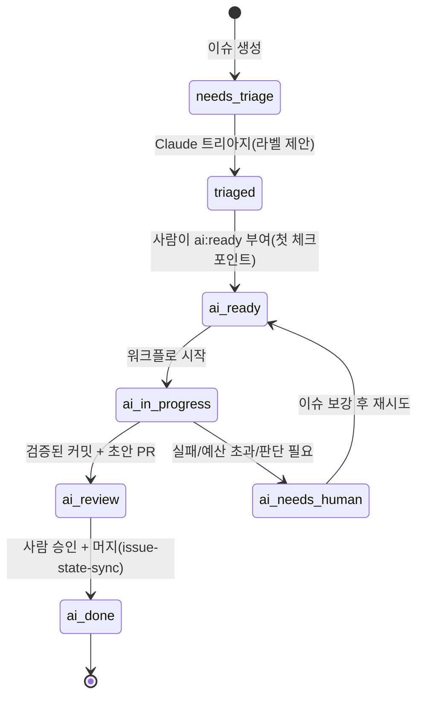

# 05. GitHub 자동화: 에이전트가 이슈와 PR을 읽고 쓰는 방법

## 1. 워크플로 목록

| 워크플로 | 트리거 | 하는 일 | 쓰기 권한 | 비용 상한 |
| --- | --- | --- | --- | --- |
| `ci.yml` | PR, main push, merge_group | `make setup-ci → lint → typecheck → test → build`, 필수 체크 `ci-ok` | 없음 | 없음 |
| `pr-checks.yml` | pull_request_target(메타데이터만) | 제목 Conventional 검사, `size/*`·`area/*` 라벨, AI 공개 체크박스 검증 → `ai:assisted`/`ai:generated`. `review-load`: 1인당 리뷰 대기 PR 상한(`MAX_OPEN_PRS_PER_AUTHOR`, 기본 3)과 Reviewer guide 알림(프로토타입 프로필에서는 끔) | PR 라벨·코멘트 | 없음 |
| `validate-ai-config.yml` | 설정 파일 변경 | `scripts/check-ai-config.sh`(플러그인·스키마·actionlint·shellcheck·yamllint·markdownlint) + zizmor | SARIF 업로드 | 없음 |
| `ai-local-runner.yml` | 이슈·PR·댓글·CI 실패·주간(`AI_BACKEND=local`) | self-hosted 러너 + 로컬 LLM에서 `scripts/ai/dispatch.sh` 실행 | contents/PR/issues | 스크립트별 턴 상한 |
| `claude.yml` | `@claude` 멘션(이슈/PR 댓글/리뷰) | 질문 답변, 요청한 변경을 커밋·푸시, "Create PR" 링크 | contents/PR/issues | 30턴 |
| `claude-code-review.yml` | PR opened/synchronize/ready | 인라인 코멘트 + 스티키 요약(승인하지 않음). 초안·봇·포크 PR 제외 | PR 코멘트 | 30턴, 새 push 시 취소 |
| `claude-issue-triage.yml` | 이슈 opened | type/area/priority/size 라벨 제안·적용, 누락 항목·중복을 댓글 1회로 알림(닫지 않음) | issues | 12턴, Bash 금지 |
| `claude-implement-issue.yml` | 라벨 `ai:ready` | 브랜치 생성 → 테스트·구현 → `make check` 통과 커밋(서명) → 초안 PR `ai:generated` → 이슈 `ai:review` | contents/PR/issues | 60턴, 45분 |
| `claude-ci-fix.yml` | CI 실패(workflow_run, 같은 레포 PR) | 실패 로그 수집 → 근본 원인 수정 → PR 브랜치를 향한 수정 PR 또는 진단 댓글 | contents/PR | 40턴 |
| `agent-approval-check.yml` | PR, 리뷰, 댓글 | 에이전트 커밋이 포함된 PR에 사람 승인 N명을 요구하는 상태 체크 `agent-approval-check` | statuses | 없음 |
| `issue-state-sync.yml` | PR opened/closed | 에이전트 PR에 `ai:generated`; 머지 시 연결 이슈 `ai:done` | issues/PR | 없음 |
| `claude-maintenance.yml` | 매주 월요일 | 유지보수 리포트 이슈 1개 생성 | issues | 20턴 |
| `contract-check.yml` | PR(계약 파일 변경 시만) | API/이벤트/스키마 파일 변경을 알리고 OpenAPI(oasdiff)·protobuf(buf) 깨지는 변경 탐지. `breaking-change` 라벨이 없으면 실패 | PR 코멘트 | 없음 |
| `design-check.yml` | PR | 변경 파일·설계를 팀 보드(`board.json`)와 비교해 겹치면 스티키 댓글, 큰 PR에 설계 링크가 없으면 알림(차단하지 않음, `no-design`으로 끔). LLM 없음 | PR 코멘트 | 없음 |
| `work-board.yml` | 30분마다, main의 설계·사이트 변경, 수동 | 등록된 레포의 활성 설계 + 열린 PR 변경 파일을 모아 `board.json` 생성, 해설 페이지와 함께 Pages 배포. LLM 없음 | pages | 없음 |
| `labels-sync.yml` | labels.yml 변경 | 라벨 동기화(PR에서는 dry-run) | issues | 없음 |
| `release-please.yml` | main push | 릴리스 PR/태그 | contents/PR | 없음 |
| `dependabot-auto-merge.yml` | Dependabot PR | minor/patch 자동 승인·자동 머지 | contents/PR | 없음 |
| `codeql.yml` | PR, main, 주간 | 코드 스캐닝(기본은 Actions 워크플로, 언어는 추가) | security-events | 없음 |
| `stale.yml` | 매일 | 60일 무활동 → 7일 후 닫힘(`ai:in-progress`, p0 제외. 이슈는 `status/blocked`도 제외) | issues/PR | 없음 |
| `copilot-setup-steps.yml` | 자기 파일 변경 | Copilot 클라우드 에이전트 환경 준비 | 없음 | 없음 |
| `bootstrap-repo.yml` | 수동 | 레포 설정·라벨·룰셋 적용(`REPO_ADMIN_TOKEN`) | admin 토큰 | 없음 |

`claude*.yml`은 `AI_BACKEND=anthropic`, `ai-local-runner.yml`은 `AI_BACKEND=local`일 때만 실행됩니다. 변수가 비어 있으면 skipped로 처리됩니다.

모든 워크플로는 최상위에 `permissions: contents: read`를 두고, 권한은 잡 단위로만 넓힙니다. 모든 잡에 `timeout-minutes`를 설정하고 PR 잡에는 `concurrency`를 설정합니다. 서드파티 액션은 SHA로 핀하며(`scripts/pin-actions.sh`) Dependabot이 갱신합니다.

## 2. 라벨 상태 머신



무한 루프는 다음 장치로 방지합니다.

- 워크플로가 `GITHUB_TOKEN`으로 라벨을 변경합니다. 이 토큰으로 발생한 이벤트는 다른 워크플로를 트리거하지 않습니다.
- Claude 액션이 봇의 트리거를 거부합니다(`allowed_bots` 비움).
- CI-fix 워크플로는 자신이 만든 브랜치(`ai/ci-fix-*`)를 대상에서 제외합니다.

## 3. 일부러 남긴 사람 체크포인트

1. `ai:ready` 라벨은 쓰기 권한자만 부여할 수 있습니다. 액션이 라벨을 부여한 사람의 권한을 한 번 더 검사합니다.
2. 에이전트 PR은 초안으로 생성되며, 리뷰어가 ready로 전환합니다.
3. AI 리뷰는 승인으로 집계되지 않습니다(Copilot은 기본값, Claude Code Review는 항상 neutral).
4. 에이전트 커밋이 포함된 PR에는 `agent-approval-check`가 사람 승인 N명을 요구합니다(Anthropic 내부와 같은 게이트).
5. `risk/low` + `ai:generated` + 승인 완료 조건의 자동 머지는 선택 기능이며 기본값은 꺼짐입니다([06](06-code-review-policy.md)).

## 4. 백엔드 선택(기본값은 설정 없음)

| `AI_BACKEND` 변수 | 동작 |
| --- | --- |
| (비움, 기본) | `claude*.yml`과 `ai-local-runner.yml`은 전부 skipped. CI·PR 검사·라벨·릴리스는 정상 |
| `anthropic` | `claude*.yml`이 공식 액션으로 실행. 시크릿 `CLAUDE_CODE_OAUTH_TOKEN`(구독, `claude setup-token`) 또는 `ANTHROPIC_API_KEY` 필요 |
| `local` | `ai-local-runner.yml`이 self-hosted 러너에서 `scripts/ai/dispatch.sh` 실행. 변수 `AI_BASE_URL`, `AI_MODEL`(로컬 LLM) |

백엔드 설정과 관계없이 개발자는 자기 자리에서 `make ai-triage ISSUE=1` 등의 명령으로 같은 작업을 실행할 수 있습니다. 이 명령은 구독 로그인을 사용하므로 API 키가 필요하지 않습니다. 백엔드 선택 기준은 [`docs/13-ai-backends.md`](13-ai-backends.md)에 정리되어 있습니다.

```bash
# ③ Anthropic 모드일 때만
gh variable set AI_BACKEND -b anthropic
gh secret set CLAUDE_CODE_OAUTH_TOKEN        # 또는 gh secret set ANTHROPIC_API_KEY
# Claude GitHub App 설치: claude 안에서 /install-github-app (또는 https://github.com/apps/claude)
# ② 로컬 모드일 때만
gh variable set AI_BACKEND -b local; gh variable set AI_BASE_URL -b http://127.0.0.1:8080; gh variable set AI_MODEL -b local-coder
# 공통(관리자 1회)
make github-setup                            # 설정·라벨·룰셋
gh secret set RELEASE_PLEASE_TOKEN           # 선택: 릴리스 태그로 배포 워크플로를 트리거할 때
```

- 구독 토큰은 개인 계정에 귀속됩니다. 조직 레포에는 API 키 또는 Workload Identity Federation(정적 키 없음)을 권장합니다. Bedrock/Vertex/Foundry는 `use_bedrock|use_vertex|use_foundry` + OIDC + 커스텀 GitHub App으로 구성합니다.
- 공개 레포에서 쓰기 권한이 없는 사용자의 이슈를 트리아지하려면 `allowed_non_write_users: "*"` + `github_token: ${{ secrets.GITHUB_TOKEN }}`을 설정합니다(워크플로 주석 참고). PAT는 사용하지 않습니다.

## 5. 액션 동작(anthropics/claude-code-action@v1)

- `prompt`가 있으면 자동화 모드로 동작합니다(멘션 불필요, 추적 댓글 없음). 없으면 태그 모드로 동작합니다(`@claude`, `label_trigger`, `assignee_trigger`, 추적 댓글과 안전한 push 래퍼). `track_progress: true`를 지정하면 prompt를 쓰면서 태그 모드로 동작합니다.
- 기본 도구는 파일 읽기/편집, 댓글, 기본 GitHub 조작으로 한정됩니다. Bash는 `--allowedTools "Bash(make test)"`처럼 명시해야 사용할 수 있습니다.
- 내장 MCP: `mcp__github_comment__*`, `mcp__github_inline_comment__create_inline_comment`(PR 승인 불가), `mcp__github_ci__*`(actions: read), `mcp__github__*`(공식 GitHub MCP 서버 v0.17.1. `get_issue`, `update_issue`, `add_issue_comment`, `create_pull_request` 등 구 이름)
- PR 이벤트에서는 액션이 `.claude/`, `CLAUDE.md`, `.mcp.json`, 훅을 베이스 브랜치에서 복원합니다. 따라서 PR로 Claude 설정을 변경할 수 없습니다. 훅은 `npm run` 대신 바이너리를 직접 호출합니다.
- 기본 동작에서 Claude는 PR을 생성하지 않고 "Create PR" 링크를 남깁니다. 이 레포에서는 액션 출력 `branch_name`/`github_token`을 받은 결정적 단계가 초안 PR을 생성합니다.
- `use_commit_signing: true`이면 API로 커밋하므로 Verified 표시가 붙고 서명 커밋 규칙과 호환됩니다.
- 비용 제어: `--max-turns`, `timeout-minutes`, `concurrency`, `--model`(예: `claude-sonnet-5-5`), `--max-budget-usd`(CLI)

## 6. 다른 에이전트와 리뷰 봇

| 도구 | 시작 방법 | 설정 파일 | 비고 |
| --- | --- | --- | --- |
| Copilot 클라우드 에이전트 | 이슈 담당자(Assignees)에 Copilot 지정, `gh agent-task create "…"`, MCP `assign_copilot_to_issue` | `AGENTS.md`, `copilot-setup-steps.yml`, 레포 설정의 MCP/방화벽 | 초안 PR, 요청자 승인 미집계, Actions는 "Approve and run workflows" 필요 |
| Copilot code review | 룰셋 "Automatically request Copilot code review"(`scripts/rulesets/optional-copilot-review.json`) | `copilot-instructions.md`, `*.instructions.md`, `REVIEW.md` | 기본은 승인 미집계, Lite/Balanced |
| OpenAI Codex | PR 댓글 `@codex review`, 설정에서 Automatic review | `AGENTS.md` `## Code Review Rules` | P0/P1만 플래그 |
| Google Jules | 이슈에 라벨 `jules` | `AGENTS.md` | 완료 시 PR 링크 댓글 |
| Gemini Code Assist | 자동 리뷰, `/gemini review` | `.gemini/config.yaml`, `styleguide.md` | 소비자용 앱은 2026-07 종료, 엔터프라이즈만 남음 |
| CodeRabbit | 자동 리뷰, `@coderabbitai review` | `.coderabbit.yaml` | 공개 레포 무료 |
| Cursor Bugbot | 자동, `bugbot run` | `.cursor/BUGBOT.md`, `.cursor/config/bugbot.yaml` | 사용량 과금 |
| GitHub Agentic Workflows(gh-aw) | `.github/workflows/*.md` → `gh aw compile` | 프런트매터 + 마크다운, `safe-outputs` | 읽기 전용 에이전트 + 검증된 쓰기(프리뷰) |

리뷰 봇을 여러 개 동시에 켜면 코멘트 소음이 늘어납니다. 봇 하나(기본: Claude)로 시작해 2–4주 보정한 뒤 추가합니다([06](06-code-review-policy.md)).

## 7. 끄거나 바꾸기

- 사용하지 않는 워크플로는 파일을 삭제하거나 `on:`에 `workflow_dispatch`만 남깁니다.
- 모델·턴·도구는 각 워크플로의 `claude_args`에서 변경합니다. 프롬프트도 워크플로 파일 안에 있으므로 변경 시 PR 리뷰를 거칩니다.
- 조직 전체에 같은 워크플로를 강제하려면 `workflow_call`로 재사용 워크플로를 만들고 조직 룰셋 "Require workflows to pass"로 요구합니다([07](07-multi-repo-strategy.md)).

## 출처

- claude-code-action: https://github.com/anthropics/claude-code-action (README, docs/, examples/) · Claude Code GitHub Actions: https://code.claude.com/docs/en/github-actions
- agent-approval-check: https://github.com/anthropics/claude-code-action/tree/main/agent-approval-check
- GitHub MCP server: https://github.com/github/github-mcp-server · Copilot cloud agent: https://docs.github.com/en/copilot/how-tos/use-copilot-agents/cloud-agent/use-cloud-agent-on-github
- GITHUB_TOKEN 연쇄 트리거 제한: https://docs.github.com/en/actions/how-tos/write-workflows/choose-when-workflows-run/trigger-a-workflow
- gh-aw: https://github.com/github/gh-aw · Codex GitHub: https://learn.chatgpt.com/docs/third-party/github · Jules: https://jules.google/docs/running-tasks/
