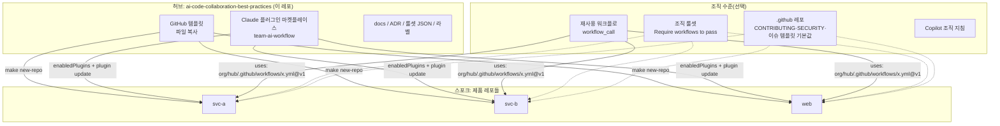

# 07. 멀티 레포 전략: 허브 하나, 스포크 여럿

## 1. 구조



## 2. 무엇을 어떤 채널로 공유하는지

| 공유 대상 | 채널 | 갱신 방식 | 비고 |
| --- | --- | --- | --- |
| `AGENTS.md`, `CLAUDE.md`, 도구 래퍼, 이슈/PR 템플릿, 워크플로, Makefile | 템플릿 복사(`gh repo create --template`) | 복사 시점 스냅샷. 이후는 동기화 PR | 조직 `.github` 레포로는 `AGENTS.md`/`CLAUDE.md`/워크플로를 배포할 수 없음 |
| 훅·스킬·서브에이전트 | 플러그인 마켓플레이스(`.claude-plugin/marketplace.json`) | 각 레포 `.claude/settings.json`의 `enabledPlugins`, `claude plugin update` | 버전은 semver + git tag(`claude plugin tag`). 관리형 설정으로 조직 전체 강제 가능 |
| 커뮤니티 파일(CONTRIBUTING, SECURITY, SUPPORT, CODE_OF_CONDUCT, 이슈 템플릿) | 조직 `.github` 레포 기본값 | 레포에 자체 파일이 있으면 그 파일이 우선 | LICENSE는 불가 |
| CI 잡 | 재사용 워크플로(`workflow_call`) + 조직 룰셋 "Require workflows to pass" | 태그/SHA로 핀 | Enterprise Cloud에서 조직 수준 요구 |
| 브랜치 보호 | 룰셋 JSON(`scripts/rulesets/`) + `make github-setup`, 또는 조직 룰셋 | 스크립트 재실행(PUT) | Pro/Team/Enterprise(공개 레포는 무료) |
| 라벨 | `.github/labels.yml` + `labels-sync.yml` | PR로 변경 | 상태 라벨이 모든 레포에서 같아야 자동화가 동작 |
| 의존성 정책 | Dependabot(레포별) 또는 Renovate 공유 프리셋 `local>org/renovate-config` | 중앙 1곳 | Renovate는 프리셋 상속이 강점 |
| Copilot 지침 | 조직 커스텀 지침(최하위 우선순위) + 레포 `AGENTS.md` | 조직 설정 | |
| 템플릿 변경의 사후 전파 | `repo-file-sync-action`(파일 동기화 PR), Copier `copier update`(3-way), cruft | 주기 PR | 사람이 PR을 보고 머지 |

## 3. 새 레포 만들기

```bash
make new-repo REPO=my-org/svc-payments VISIBILITY=private
# = gh repo create --template <hub> --private --clone
#   scripts/bootstrap.sh --mode project --marketplace <hub>   (허브 전용 파일 제거, 마켓플레이스 지정)
#   scripts/setup-github.sh all                              (설정·라벨·룰셋)
```

그다음 사람이 채울 것: `AGENTS.md`의 Project 섹션, `CODEOWNERS`, `labels.yml`의 `area/*`, `ci.yml`/`codeql.yml` 언어, 시크릿, Claude 앱 설치([12](12-setup-checklist.md)).

## 4. 스포크를 최신으로 유지하기

- 플러그인: 허브에서 `plugins/team-ai-workflow` 버전을 올리고 태그를 달아요. 스포크에서는 `claude plugin update team-ai-workflow@ai-collab`으로 받아요(재시작할 때 자동으로 받기도 해요).
- 워크플로·템플릿 파일: 허브에 `repo-file-sync-action`을 두면 바뀐 파일로 각 스포크에 PR을 열어요(토큰: App). Copier로 템플릿을 관리하면 `copier update`가 3-way 병합을 해 줘요.
- 규칙 텍스트: `AGENTS.md`의 Project 섹션은 레포마다 달라요. 그래서 파일을 통째로 동기화하지 말고 "공통 섹션"만 동기화하거나 `@docs/team-rules.md` import 블록으로 분리해요.

## 5. 모노레포와 폴리레포(에이전트 관점)

- 에이전트는 현재 레포 밖을 보지 못해요. 폴리레포에서 여러 레포를 함께 바꿀 때는 Claude `--add-dir ../other`(`permissions.additionalDirectories`)로 형제 체크아웃을 열어 주거나, 작업 디렉터리에 관련 레포를 나란히 클론하고 루트에 지시 파일을 둬요("virtual monorepo").
- 모노레포에서는 패키지 디렉터리에서 세션을 시작하고 패키지마다 `AGENTS.md`를 둬요(가장 가까운 파일이 우선). 빌드·테스트 명령도 패키지 단위로 좁혀요.
- GitHub 공식 가이드에 따르면 여러 레포에 걸친 리팩터링은 클라우드 에이전트에 맞지 않아요. 사람이 작업을 쪼개요.
- 병렬 에이전트는 서로 다른 파일을 맡도록 작업을 나누고, worktree로 체크아웃을 분리해요.

## 6. 버전 관리 규칙

- 플러그인은 semver를 따라요. 훅 동작 변경(차단 규칙 추가)은 minor, 기존 스킬 제거는 major예요. CI에서 `claude plugin validate --strict`가 돌아요.
- 룰셋·라벨·워크플로 변경은 ADR이나 CHANGELOG(릴리스 PR)에 기록해요.
- 스포크는 재사용 워크플로를 참조할 때 허브의 릴리스 태그(`vX.Y.Z`)로 핀해요.

## 출처

- 조직 커뮤니티 파일: https://docs.github.com/en/communities/setting-up-your-project-for-healthy-contributions/creating-a-default-community-health-file
- 템플릿 레포: https://docs.github.com/en/repositories/creating-and-managing-repositories/creating-a-template-repository
- 재사용 워크플로: https://docs.github.com/en/actions/sharing-automations/reusing-workflows
- Claude 플러그인 마켓플레이스: https://code.claude.com/docs/en/plugin-marketplaces · 모노레포/worktree: https://code.claude.com/docs/en/worktrees
- repo-file-sync-action: https://github.com/BetaHuhn/repo-file-sync-action · Copier update: https://copier.readthedocs.io/en/stable/updating/ · Renovate presets: https://docs.renovatebot.com/config-presets/
- GitHub mission control(병렬 에이전트 분할): https://github.blog/ai-and-ml/github-copilot/how-to-orchestrate-agents-using-mission-control/
