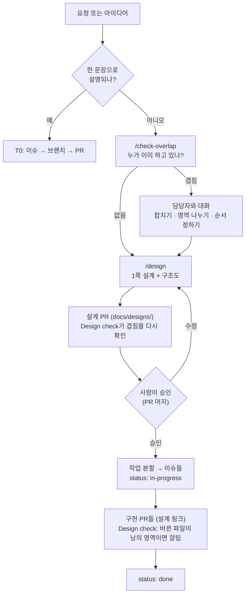

# 14. 설계 먼저, 겹치지 않게: 이슈보다 큰 일을 다루는 법

## 1. 풀려는 문제

AI를 쓰는 팀에서는 다음 두 가지 문제가 자주 발생합니다.

1. **영역이 모호한 일에서 중복 작업.** 범위를 명확히 나누기 어려운 일을 두 사람이 각자 AI로 진행하면 같은 모듈을 수정하거나 같은 기능을 따로 구현하게 됩니다. git은 같은 파일의 충돌만 감지하며 같은 기능을 두 번 만드는 상황은 감지하지 못합니다.
2. **설계 없이 바로 구현.** 요청을 받은 AI가 곧바로 코드를 작성하고 방향이 틀렸다는 사실은 리뷰 단계에서야 드러납니다. 1,000줄을 리뷰한 뒤 되돌리는 것보다 1쪽 분량의 설계를 먼저 검토하는 쪽이 비용이 훨씬 적습니다.

## 2. 접근: 일의 크기에 따른 세 단계

모든 작업에 설계 문서를 요구하면 문서가 누적되고 승인 대기가 병목이 됩니다(Uber의 RFC 과부하 사례, Thoughtworks가 spec-driven 개발을 "Assess"로 분류한 이유). 따라서 작업의 크기와 불확실성에 따라 필요한 절차를 세 단계로 구분합니다.

| 단계 | 기준 | 필요한 것 | 승인 |
| --- | --- | --- | --- |
| **T0** | 한 문장으로 설명되는 변경 (버그 수정, 작은 기능) | 이슈 + 브랜치. 브랜치와 초안 PR이 곧 담당 표시 | 일반 PR 리뷰 |
| **T1** | 여러 파일, 접근법이 하나로 정해지지 않음 | AI의 plan 모드 계획을 PR 본문 맨 위에 기재. 코드 작성 전 초안 PR로 공유 | 계획에 대한 리뷰어 OK 후 구현 |
| **T2** | 여러 모듈·레포, 공개 인터페이스·스키마 변경, 하루 이상, 영역이 모호함 | `docs/designs/NNNN-*.md` 1쪽 설계 + Mermaid 구조도. 설계만 담은 작은 PR | 설계 PR 머지 = 승인. 이후 구현 PR이 설계를 링크 |

판단이 애매하면 T2로 분류합니다. 초안은 AI가 작성하므로 몇 분이면 충분합니다(`/design`).

## 3. 흐름

## 4. 중복을 감지하는 장치: 팀 작업판(work board)

설계 문서의 머리말(front matter)에 담당자와 영역(`areas`)을 기재합니다. 영역은 경로 글롭(`src/auth/**`) 또는 이름 붙은 영역(`api:/login`, `db:sessions`, `ui:checkout`)입니다.

| 장치 | 동작 | 토큰 비용 |
| --- | --- | --- |
| `.github/workflows/work-board.yml` (허브) | 30분마다 `.github/work-board-repos.txt`의 모든 레포에서 활성 설계와 열린 PR의 변경 파일을 수집해 `board.json`으로 Pages에 게시 | 0 (LLM 없음) |
| `scripts/designs/board.py overlap` | 작업 예정인 경로·영역과 활성 설계, 열린 PR의 겹침 여부를 글롭으로 비교 | 0 |
| `.github/workflows/design-check.yml` | 모든 PR에서 위 비교를 실행해 겹치면 댓글 작성. 설계 링크가 없는 큰 PR에 알림 (차단하지 않음, `no-design` 라벨로 해제) | 0 |
| `/check-overlap` 스킬 | 작업 시작 전 AI가 위 명령을 실행하고 결과를 두 줄로 보고 | 수백 토큰 |
| 세션 시작 | 활성 설계 목록을 한 줄씩(최대 40줄) AI 컨텍스트에 추가 | 설계 50개 기준 약 1.5~2K 토큰 |

토큰 비용이 낮은 이유는 다음과 같습니다. 매 세션 AI가 여러 레포의 PR을 읽으면 세션당 수만~수십만 토큰이 소모되고 컨텍스트가 차면서 작업 품질도 떨어집니다. 이 구조에서는 스케줄 작업이 한 번 수집하고 결정적 스크립트가 겹침을 판정하며 AI는 한 줄 요약만 읽습니다.

오래된 표시: `updated`가 21일 넘게 갱신되지 않은 활성 설계에는 `stale` 표시가 붙습니다. 방치된 담당 표시가 다른 사람의 작업을 막지 않도록 하기 위한 장치입니다(`DESIGN_STALE_DAYS`로 조정).

## 5. 대화를 늘리는 것으로 충분하지 않은 이유

대화는 여전히 필요합니다. 다만 AI는 회의에 참석하지 않고, 사람은 모든 채팅 내용을 기억하지 못합니다. 이 구조는 대화를 대체하지 않으며, 대화가 필요한 시점을 알립니다. 겹침이 감지되면 "@alice와 먼저 협의하라"는 결과가 출력됩니다. 다중 에이전트 실험에서도 상대가 진행 중인 변경을 알려 주는 것만으로 실패의 대부분이 회복되었습니다(arXiv 2609.25396).

정기 모임은 하나로 충분합니다. 주 1회 15분 동안 작업판을 함께 보며 겹침과 오래된 설계를 정리합니다.

## 6. 이슈 단위가 아닌 작업

| 작업의 종류 | 처리 방법 |
| --- | --- |
| 이니셔티브/에픽 (여러 주, 여러 사람) | T2 설계 1개가 부모. "작업 분할"의 각 줄이 하위 이슈(sub-issue). 설계의 `issues`에 번호를 기재해 연결 |
| 탐색·스파이크 (만들 대상이 미정) | 기한(예: 2일)을 정한 `spike/<주제>` 브랜치에서 자유롭게 진행. 결과물은 코드가 아닌 설계 문서. 스파이크 코드는 머지하지 않음 |
| 여러 레포 변경 | 설계의 `repos`에 모두 기재. 구현은 레포별 PR로 나누고 각 PR이 설계를 링크. 순서(예: API 먼저, 클라이언트 나중)를 설계에 명시 |
| 대규모 리팩터링 | T2. 영역을 넓게(`src/**`) 잡으면 모든 작업과 겹치므로 단계별로 영역을 좁혀 여러 설계로 분할 |
| 장애 대응·핫픽스 | 설계 생략(`no-design` 라벨). 종료 후 필요하면 사후 ADR 작성 |
| 운영·설정·문서 | 대부분 T0 |

## 7. 도입 순서

1. 첫 주: 허브의 `.github/work-board-repos.txt`에 팀 레포를 기재하고 비공개 레포가 있으면 `BOARD_TOKEN` 시크릿을 추가합니다.
2. 다음 T2 작업 하나를 `/design`으로 시작합니다. 설계 PR 리뷰는 하루 안에 마칩니다. 리뷰가 늦어진다면 그 자체가 점검이 필요하다는 신호입니다.
3. 2주 후 회고: 겹침 알림이 실제로 대화로 이어졌는지, 설계가 리뷰 시간을 줄였는지 확인합니다. 알림이 소음에 가깝다면 T2 기준을 높입니다.

## 8. 하지 않는 것

- 설계 승인이 없다는 이유로 PR을 차단하지 않습니다. 알림만 보냅니다. 차단하면 문서가 형식적으로 작성되기 시작합니다.
- AI가 매 세션 모든 PR을 읽게 하지 않습니다.
- 설계 문서를 길게 쓰지 않습니다. 1쪽, 구조도 하나가 기준입니다.

## 출처

- Anthropic, Claude Code best practices("한 문장이면 계획 생략", "인터뷰 후 SPEC.md"): https://code.claude.com/docs/en/best-practices
- Thoughtworks Radar, Spec-driven development(Assess): https://www.thoughtworks.com/radar/techniques/spec-driven-development
- Birgitta Böckeler, spec-driven 도구 체험기: https://martinfowler.com/articles/exploring-gen-ai/sdd-3-tools.html
- Google design docs: https://www.industrialempathy.com/posts/design-docs-at-google/ · Oxide RFD: https://rfd.shared.oxide.computer/rfd/0001
- Uber RFC 확장 경험: https://blog.pragmaticengineer.com/scaling-engineering-teams-via-writing-things-down-rfcs/
- OpenSpec: https://github.com/Fission-AI/OpenSpec · GitHub Spec Kit: https://github.com/github/spec-kit
- Anthropic agent teams(팀원별 파일 소유): https://code.claude.com/docs/en/agent-teams
- AgenticFlict(에이전트 PR 충돌률): https://arxiv.org/abs/2604.03551 · Passes Alone, Fails Together: https://arxiv.org/abs/2609.25396
