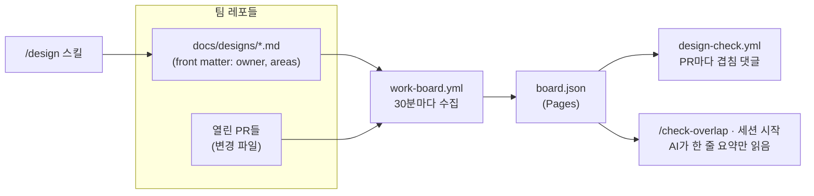

# 설계 우선 단계와 레포 간 작업판

## 1. 문제와 목표

AI로 작업하는 팀원들이 모호한 영역에서 같은 일을 중복으로 수행하고, 설계 없이 바로 구현했다가 리뷰에서 되돌립니다.
목표: 큰 작업은 사람이 1쪽 설계를 먼저 승인하고, 영역별 담당자를 모든 AI가 적은 비용으로 확인할 수 있게 합니다.
하지 않을 것: PR 차단, 매 세션 전체 PR 스캔, 긴 명세서.

## 2. 구조도

## 3. 설계

- 설계 문서 머리말: `id, title, status, owner, repos, areas, issues, updated`.
- `scripts/designs/board.py`: `index`, `overlap`, `brief`, `aggregate`. 글롭 접두사·이름 영역 비교, LLM 없음.
- 허브 `work-board.yml`이 사이트와 `board.json`을 함께 배포(기존 `pages.yml` 대체).
- `design-check.yml`: 겹침과 "큰 PR인데 설계 링크 없음"을 한 댓글로 갱신. 막지 않음.

## 4. 대안

- 모든 작업에 설계 강제: 병목·형식화. 기각.
- AI가 매번 모든 레포의 PR을 읽음: 세션당 수만 토큰. 기각.
- 회의만 늘림: AI는 참석 불가. 보완재로 주 1회 15분 작업판 리뷰 유지.

## 5. 작업 분할

1. board.py + 템플릿 + 이 문서
2. work-board.yml, design-check.yml
3. /design, /check-overlap 스킬, 세션 시작 요약
4. 문서 14, 해설 페이지 갱신

## 6. 검증

샘플 설계 두 개로 글롭·이름 영역 겹침 판정 확인. 실제 PR에서 design-check 댓글 확인. 2주 뒤 회고.

## 7. 열린 질문

없음.
