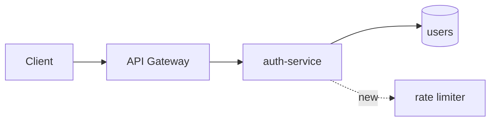

# 제목

## 1. 문제와 목표 (3~5줄)

해결할 문제와, 작업이 끝났을 때 참이 되는 상태를 기술합니다. 하지 않을 것(Non-goals)도 한 줄 기재합니다.

## 2. 구조도

변경 전/후를 한눈에 비교할 수 있게 그립니다. GitHub에서 바로 렌더링되는 Mermaid를 사용합니다.

## 3. 설계

- 바뀌는 컴포넌트/파일, 새 인터페이스(시그니처, 스키마, 이벤트)
- 데이터 흐름, 실패 시 동작
- 다른 팀/레포에 미치는 영향

## 3-1. 계약(Contract) 변화

레포·팀 사이의 약속이 바뀌는지 기재합니다. 바뀐다면 이 절이 설계의 중심입니다. 변경이 없으면 "없음"으로 기재합니다.

- 대상: API(OpenAPI) · 이벤트/메시지(스키마) · DB 스키마 · 공개 함수/SDK · 설정 키
- 호환성: 하위 호환 / 깨짐(→ 버전·기간·전환 순서)
- 소비자: 이 계약을 쓰는 레포·팀 (front matter `repos`에도 넣고, `areas`에 `contract:<이름>`을 적어 겹침 확인에 걸리게)
- 계약 파일: `contracts/…` 경로. 계약 PR을 구현보다 먼저 머지

## 4. 대안과 선택 이유 (2개 이상, 각 한 줄)

## 5. 작업 분할

PR 단위로 나눕니다. 각 줄이 이슈 하나가 됩니다. PR별 담당자도 기재합니다.

## 6. 검증

완료를 확인할 테스트나 지표를 기재합니다.

## 7. 열린 질문

결정이 필요한 사항을 기재합니다. 승인 전에 모두 해결해 비웁니다.
