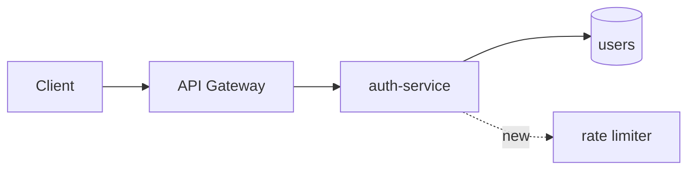

# 제목

## 1. 문제와 목표 (3~5줄)

무엇이 문제이고, 끝나면 무엇이 참이 되는가. 하지 않을 것(Non-goals)도 한 줄.

## 2. 구조도

변경 전/후가 한눈에 보이게. GitHub에서 바로 렌더링되는 Mermaid를 씁니다.

## 3. 설계

- 바뀌는 컴포넌트/파일, 새 인터페이스(시그니처, 스키마, 이벤트)
- 데이터 흐름, 실패 시 동작
- 다른 팀/레포에 미치는 영향

## 4. 대안과 선택 이유 (2개 이상, 각 한 줄)

## 5. 작업 분할

PR 단위로. 각 줄이 이슈 하나가 됩니다. 누가 어느 PR을 맡는지.

## 6. 검증

어떤 테스트/지표로 "됐다"를 확인하는가.

## 7. 열린 질문

결정이 필요한 것. 승인 전에 비워야 합니다.
